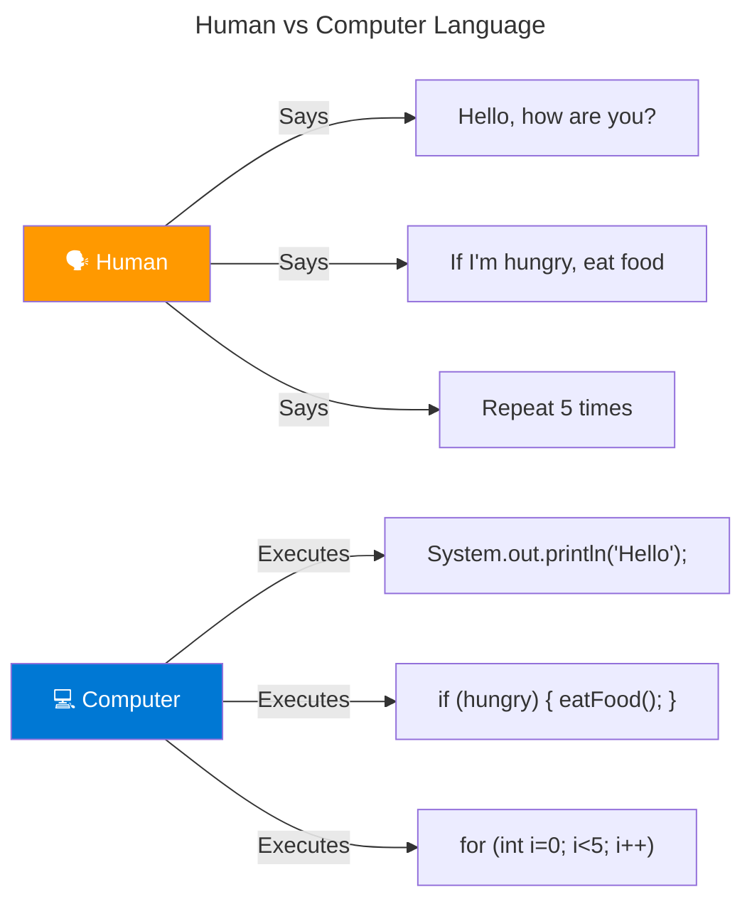
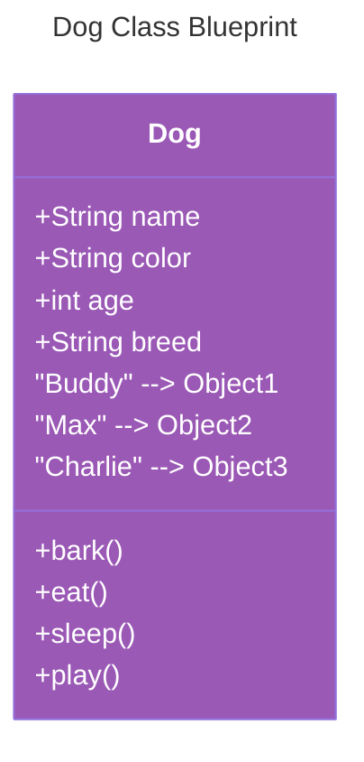
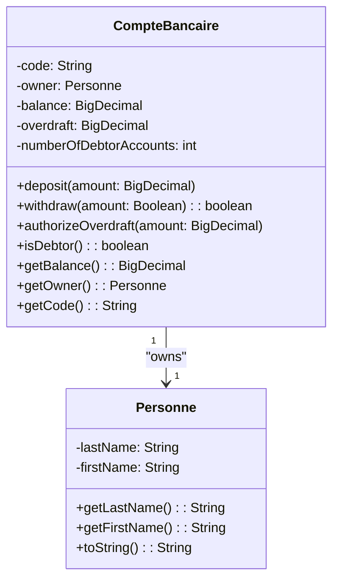
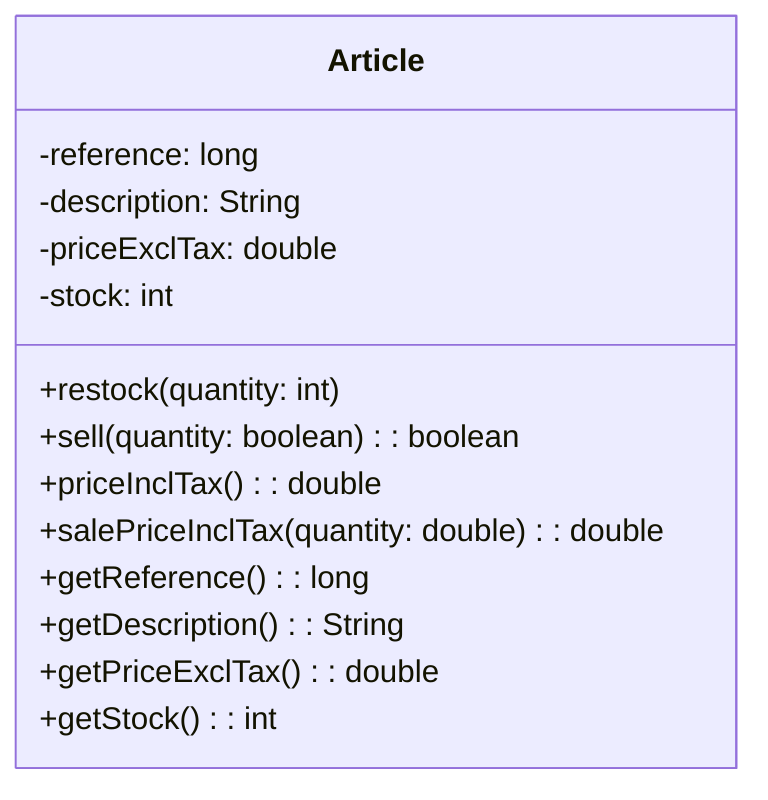
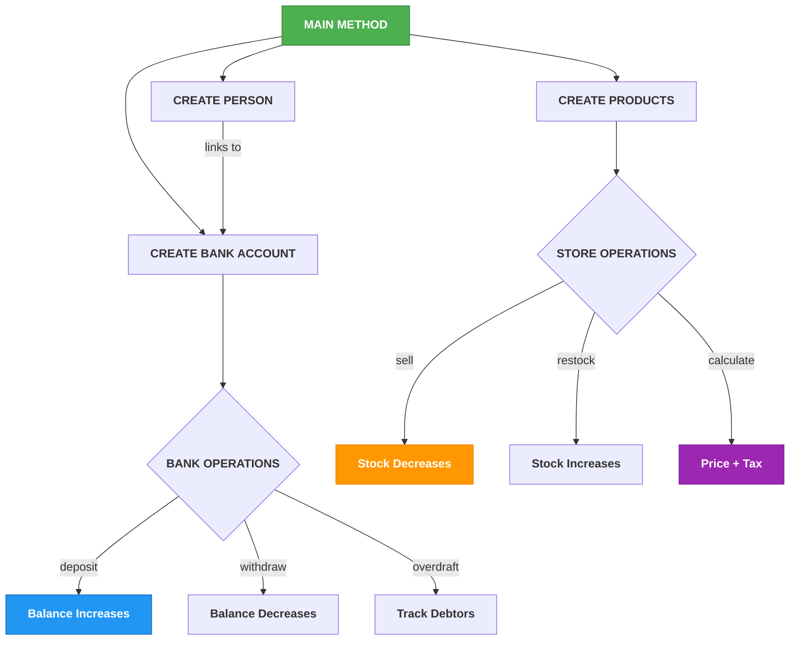
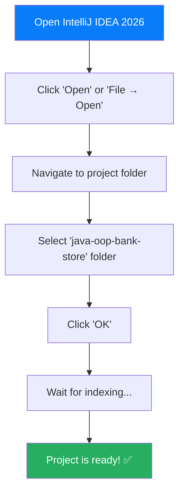

# 🏦💰 Java OOP Bank & Store Management System

<p align="center">
  
</p>

<div align="center">


</div>

---

<p align="center">
  
</p>

---

## 📋 Table of Contents

1. [Welcome](#1-welcome)
2. [What is Java?](#2-what-is-java)
3. [What is OOP?](#3-what-is-object-oriented-programming)
4. [Project Features](#4-project-features)
5. [Prerequisites](#5-prerequisites)
6. [Installation](#6-installation)
7. [Project Structure](#7-project-structure)
8. [UML Diagrams](#8-uml-diagrams)
9. [How to Run](#9-how-to-run)
10. [Tutorial](#10-tutorial)
11. [Code Explanation](#11-code-explanation)
12. [OOP Concepts](#12-oop-concepts)
13. [FAQ](#13-faq)
14. [Author](#14-author)
15. [License](#15-license)

---

## 1. Welcome

<p align="center">
  
</p>

### Welcome to the Ultimate Java OOP Learning Project!

This is a comprehensive educational project designed to teach you **Object-Oriented Programming (OOP)** from scratch!

---

### What You'll Build

| 🏦 Banking System | 🛒 Store System |
|-------------------|-----------------|
| Manage bank accounts | Manage products |
| Deposit & Withdraw | Buy & Sell items |
| Track debtors | Calculate prices |
| Overdraft management | Inventory tracking |

---

## 2. What is Java?

<p align="center">
  
</p>

### Imagine This...

You're teaching a robot to make a sandwich. You need to give it **step-by-step instructions**:

```
1. Get bread
2. Get peanut butter
3. Spread peanut butter on bread
4. Get jelly
5. Spread jelly on bread
6. Put another bread on top
7. Give sandwich to person
```

**Java is exactly that!** It's a language where you give the computer step-by-step instructions!

---

### Why Java is Amazing?

| Feature | Explanation | Icon |
|---------|-------------|------|
| **Write Once, Run Anywhere** | One code runs on Windows, Mac, Linux, phones! | 🖥️📱💻 |
| **Used by Giants** | Google, Amazon, Netflix, Banks all use Java! | 🏢🏦🌐 |
| **Easy to Learn** | English-like words, very readable! | 📖✏️ |
| **High Demand** | Java developers earn great salaries! | 💰💵 |
| **Super Reliable** | Banks trust Java for their money systems! | 🔒🏦 |

---

### Human vs Computer Language (Mermaid)



---

## 3. What is Object-Oriented Programming?

<p align="center">
  
</p>

**OOP** is just a way to organize code that matches how real life works!

---

### Real-World Example: Dogs (Mermaid)



### Objects in Action (Mermaid)

```mermaid
---
title: Dog Objects Created from Class
---
graph LR
    subgraph BUDDY["BUDDY (Object #1)"]
        B1[name: "Buddy"]
        B2[color: "Golden"]
        B3[age: 3]
    end
    
    subgraph MAX["MAX (Object #2)"]
        M1[name: "Max"]
        M2[color: "Black"]
        M3[age: 5]
    end
    
    DOG[Dog Class Blueprint] -->|Creates| BUDDY
    DOG -->|Creates| MAX
    
    style DOG fill:#e74c3c,color:#fff
    style BUDDY fill:#27ae60,color:#fff
    style MAX fill:#3498db,color:#fff
```

---

### In Our Project (Mermaid)

```mermaid
---
title: Article Class and Objects
---
classDiagram
    class Article {
        +long reference
        +String description
        +double priceExclTax
        +int stock
        +restock()
        +sell()
        +priceInclTax()
    }
    
    A1[📱 iPhone 15] : ref=1001, price=$999
    A2[💻 MacBook Pro] : ref=1002, price=$1499
    A3[📺 Samsung TV] : ref=1003, price=$599
    
    Article -->|Creates| A1
    Article -->|Creates| A2
    Article -->|Creates| A3
    
    style Article fill:#f39c12,color:#fff
```

---

## 4. Project Features

### Banking System Features

| Feature | Description |
|---------|-------------|
| ✅ Create Account | Open new bank accounts |
| ✅ Deposit Money | Add money to account |
| ✅ Withdraw Money | Take money out |
| ✅ Overdraft | Set borrowing limit |
| ✅ Track Debtors | Monitor negative accounts |

### Store System Features

| Feature | Description |
|---------|-------------|
| ✅ Create Product | Add new items |
| ✅ Restock | Add inventory |
| ✅ Sell | Process sales |
| ✅ Calculate Tax | Price with 10% tax |
| ✅ Bulk Pricing | Multi-item totals |

---

## 5. Prerequisites

### Everything You Need is FREE!

| Tool | Version | Purpose | Download |
|------|---------|---------|----------|
| **Java JDK** | 17+ | Programming language | [Download](https://www.oracle.com/java/technologies/downloads/) |
| **VS Code** | Latest | Code editor | [Download](https://code.visualstudio.com/) |
| **Git** | Latest | Version control | [Download](https://git-scm.com/) |

---

### Verify Java Installation

```bash
java -version
```

**You should see:**
```
java version "17.0.x"
Java(TM) SE Runtime Environment (build 17.0.x+...)
```

---

## 6. Installation

### Step 1: Download

1. Go to: https://github.com/Lagmouchyoussef/java-oop-bank-store---Simple-and-descriptive
2. Click the green "Code" button
3. Click "Download ZIP"
4. Save to your Desktop

### Step 2: Extract

1. Right-click the ZIP file
2. Select "Extract All"
3. Choose a folder location
4. Click "Extract"

### Step 3: Open in Editor

**VS Code (Recommended):**
1. Open VS Code
2. Click File → Open Folder
3. Select the extracted folder
4. Install "Java Extension Pack" if asked

**IntelliJ IDEA:**
1. Open IntelliJ IDEA
2. Click File → Open
3. Select the folder
4. Wait for loading...

---

## 7. Project Structure

### File Tree

```
📦 java-oop-bank-store
│
├── 📂 src/
│   ├── 📂 ma/emsi/projets/
│   │   ├── 📂 banque/          🏦 Bank Module
│   │   │   ├── 💰 CompteBancaire.java    ← Main bank code
│   │   │   └── 👤 Personne.java         ← Person class
│   │   │
│   │   └── 📂 magasin/          🛒 Store Module
│   │       └── 📦 Article.java          ← Product code
│   │
│   └── 🚀 Main.java             ← Entry point
│
├── 📄 README.md                 ← You are here!
├── 📦 TP2.iml                  ← IntelliJ settings
└── 📜 .gitignore               ← Git ignore rules
```

### File Descriptions

| File | Purpose |
|------|---------|
| `CompteBancaire.java` | Bank account logic |
| `Personne.java` | Person/owner info |
| `Article.java` | Product/store logic |
| `Main.java` | Program entry point |

---

## 8. UML Diagrams

### Bank Account System - Class Diagram



### Store System - Class Diagram



### How Everything Works Together



---

## 9. How to Run

### Option 1: Command Line

```bash
# Navigate to project
cd path/to/your/project

# Compile
javac -d out src/ma/emsi/projets/banque/*.java
javac -d out src/ma/emsi/projets/magasin/*.java

# Run Bank System
java -cp out ma.emsi.projets.banque.CompteBancaire

# Run Store System
java -cp out ma.emsi.projets.magasin.Article
```

### Option 2: VS Code

1. Open the .java file
2. Right-click anywhere
3. Click "Run Java"
4. Or press F5

### Option 3: IntelliJ IDEA 2026 - Beginner Guide

<p align="center">
  
</p>

#### Step 1: Download and Install

| Step | Action | Screenshot |
|------|--------|------------|
| 1 | Go to [JetBrains Website](https://www.jetbrains.com/idea/download/) | 🌐 |
| 2 | Download **IntelliJ IDEA 2026.1** (or latest) | 💾 |
| 3 | Run the installer | ▶️ |
| 4 | Choose **"IntelliJ IDEA Ultimate"** (recommended) | ✅ |
| 5 | Follow installation wizard | ⚙️ |

#### Step 2: Open the Project



#### Step 3: Configure JDK 17+ (Important!)

If IntelliJ doesn't detect Java automatically:

1. **File → Project Structure** (or press `Ctrl+Alt+Shift+S`)
2. Click on **"Project"** tab
3. Under **"Project SDK"**, click **"Add SDK"** → **"JDK"**
4. Navigate to your JDK installation (usually: `C:\Program Files\Java\jdk-17` or `C:\Program Files\Java\jdk-21`)
5. Select the JDK folder and click **"OK"**
6. Under **"Project language level"**, select **17** or higher
7. Click **"Apply"** → **"OK"**

#### Step 4: Run the Bank System (CompteBancaire)

| Method | Steps |
|--------|-------|
| **Method A: Run Button** | 1. Open `src/ma/emsi/projets/banque/CompteBancaire.java`
2. Look for the green ▶️ play button in the gutter (left of main method)
3. Click it and select **"Run 'CompteBancaire.main()'**" |
| **Method B: Right-click** | 1. Right-click on the `CompteBancaire.java` file in the project explorer
2. Select **"Run 'CompteBancaire.main()'**" |
| **Method C: Keyboard** | 1. Open the file
2. Press `Shift + F10` |

#### Step 5: Run the Store System (Article)

| Method | Steps |
|--------|-------|
| **Method A: Run Button** | 1. Open `src/ma/emsi/projets/magasin/Article.java`
2. Click the green ▶️ play button in the gutter
3. Select **"Run 'Article.main()'**" |
| **Method B: Right-click** | 1. Right-click on `Article.java`
2. Select **"Run 'Article.main()'**" |
| **Method C: Keyboard** | 1. Open the file
2. Press `Shift + F10` |

#### Step 6: Create Run Configurations (For Easy Access)

1. **Run → Edit Configurations...**
2. Click the **+** button (top left)
3. Select **"Application"**
4. Configure as follows:

| Setting | Value for Bank | Value for Store |
|---------|---------------|-----------------|
| **Name** | Run Bank | Run Store |
| **Main class** | `ma.emsi.projets.banque.CompteBancaire` | `ma.emsi.projets.magasin.Article` |
| **Use classpath of module** | Select your module | Select your module |
| **Working directory** | `$PROJECT_DIR# 🏦💰 Java OOP Bank & Store Management System

<p align="center">
  
</p>

<div align="center">


</div>

---

<p align="center">
  
</p>

---

## 📋 Table of Contents

1. [Welcome](#1-welcome)
2. [What is Java?](#2-what-is-java)
3. [What is OOP?](#3-what-is-object-oriented-programming)
4. [Project Features](#4-project-features)
5. [Prerequisites](#5-prerequisites)
6. [Installation](#6-installation)
7. [Project Structure](#7-project-structure)
8. [UML Diagrams](#8-uml-diagrams)
9. [How to Run](#9-how-to-run)
10. [Tutorial](#10-tutorial)
11. [Code Explanation](#11-code-explanation)
12. [OOP Concepts](#12-oop-concepts)
13. [FAQ](#13-faq)
14. [Author](#14-author)
15. [License](#15-license)

---

## 1. Welcome

<p align="center">
  
</p>

### Welcome to the Ultimate Java OOP Learning Project!

This is a comprehensive educational project designed to teach you **Object-Oriented Programming (OOP)** from scratch!

---

### What You'll Build

| 🏦 Banking System | 🛒 Store System |
|-------------------|-----------------|
| Manage bank accounts | Manage products |
| Deposit & Withdraw | Buy & Sell items |
| Track debtors | Calculate prices |
| Overdraft management | Inventory tracking |

---

## 2. What is Java?

<p align="center">
  
</p>

### Imagine This...

You're teaching a robot to make a sandwich. You need to give it **step-by-step instructions**:

```
1. Get bread
2. Get peanut butter
3. Spread peanut butter on bread
4. Get jelly
5. Spread jelly on bread
6. Put another bread on top
7. Give sandwich to person
```

**Java is exactly that!** It's a language where you give the computer step-by-step instructions!

---

### Why Java is Amazing?

| Feature | Explanation | Icon |
|---------|-------------|------|
| **Write Once, Run Anywhere** | One code runs on Windows, Mac, Linux, phones! | 🖥️📱💻 |
| **Used by Giants** | Google, Amazon, Netflix, Banks all use Java! | 🏢🏦🌐 |
| **Easy to Learn** | English-like words, very readable! | 📖✏️ |
| **High Demand** | Java developers earn great salaries! | 💰💵 |
| **Super Reliable** | Banks trust Java for their money systems! | 🔒🏦 |

---

### Human vs Computer Language (Mermaid)


---

## 3. What is Object-Oriented Programming?

<p align="center">
  
</p>

**OOP** is just a way to organize code that matches how real life works!

---

### Real-World Example: Dogs (Mermaid)


### Objects in Action (Mermaid)

```mermaid
---
title: Dog Objects Created from Class
---
graph LR
    subgraph BUDDY["BUDDY (Object #1)"]
        B1[name: "Buddy"]
        B2[color: "Golden"]
        B3[age: 3]
    end
    
    subgraph MAX["MAX (Object #2)"]
        M1[name: "Max"]
        M2[color: "Black"]
        M3[age: 5]
    end
    
    DOG[Dog Class Blueprint] -->|Creates| BUDDY
    DOG -->|Creates| MAX
    
    style DOG fill:#e74c3c,color:#fff
    style BUDDY fill:#27ae60,color:#fff
    style MAX fill:#3498db,color:#fff
```

---

### In Our Project (Mermaid)

```mermaid
---
title: Article Class and Objects
---
classDiagram
    class Article {
        +long reference
        +String description
        +double priceExclTax
        +int stock
        +restock()
        +sell()
        +priceInclTax()
    }
    
    A1[📱 iPhone 15] : ref=1001, price=$999
    A2[💻 MacBook Pro] : ref=1002, price=$1499
    A3[📺 Samsung TV] : ref=1003, price=$599
    
    Article -->|Creates| A1
    Article -->|Creates| A2
    Article -->|Creates| A3
    
    style Article fill:#f39c12,color:#fff
```

---

## 4. Project Features

### Banking System Features

| Feature | Description |
|---------|-------------|
| ✅ Create Account | Open new bank accounts |
| ✅ Deposit Money | Add money to account |
| ✅ Withdraw Money | Take money out |
| ✅ Overdraft | Set borrowing limit |
| ✅ Track Debtors | Monitor negative accounts |

### Store System Features

| Feature | Description |
|---------|-------------|
| ✅ Create Product | Add new items |
| ✅ Restock | Add inventory |
| ✅ Sell | Process sales |
| ✅ Calculate Tax | Price with 10% tax |
| ✅ Bulk Pricing | Multi-item totals |

---

## 5. Prerequisites

### Everything You Need is FREE!

| Tool | Version | Purpose | Download |
|------|---------|---------|----------|
| **Java JDK** | 17+ | Programming language | [Download](https://www.oracle.com/java/technologies/downloads/) |
| **VS Code** | Latest | Code editor | [Download](https://code.visualstudio.com/) |
| **Git** | Latest | Version control | [Download](https://git-scm.com/) |

---

### Verify Java Installation

```bash
java -version
```

**You should see:**
```
java version "17.0.x"
Java(TM) SE Runtime Environment (build 17.0.x+...)
```

---

## 6. Installation

### Step 1: Download

1. Go to: https://github.com/Lagmouchyoussef/java-oop-bank-store---Simple-and-descriptive
2. Click the green "Code" button
3. Click "Download ZIP"
4. Save to your Desktop

### Step 2: Extract

1. Right-click the ZIP file
2. Select "Extract All"
3. Choose a folder location
4. Click "Extract"

### Step 3: Open in Editor

**VS Code (Recommended):**
1. Open VS Code
2. Click File → Open Folder
3. Select the extracted folder
4. Install "Java Extension Pack" if asked

**IntelliJ IDEA:**
1. Open IntelliJ IDEA
2. Click File → Open
3. Select the folder
4. Wait for loading...

---

## 7. Project Structure

### File Tree

```
📦 java-oop-bank-store
│
├── 📂 src/
│   ├── 📂 ma/emsi/projets/
│   │   ├── 📂 banque/          🏦 Bank Module
│   │   │   ├── 💰 CompteBancaire.java    ← Main bank code
│   │   │   └── 👤 Personne.java         ← Person class
│   │   │
│   │   └── 📂 magasin/          🛒 Store Module
│   │       └── 📦 Article.java          ← Product code
│   │
│   └── 🚀 Main.java             ← Entry point
│
├── 📄 README.md                 ← You are here!
├── 📦 TP2.iml                  ← IntelliJ settings
└── 📜 .gitignore               ← Git ignore rules
```

### File Descriptions

| File | Purpose |
|------|---------|
| `CompteBancaire.java` | Bank account logic |
| `Personne.java` | Person/owner info |
| `Article.java` | Product/store logic |
| `Main.java` | Program entry point |

---

## 8. UML Diagrams

### Bank Account System - Class Diagram


### Store System - Class Diagram


### How Everything Works Together


---

 | `$PROJECT_DIR# 🏦💰 Java OOP Bank & Store Management System

<p align="center">
  
</p>

<div align="center">


</div>

---

<p align="center">
  
</p>

---

## 📋 Table of Contents

1. [Welcome](#1-welcome)
2. [What is Java?](#2-what-is-java)
3. [What is OOP?](#3-what-is-object-oriented-programming)
4. [Project Features](#4-project-features)
5. [Prerequisites](#5-prerequisites)
6. [Installation](#6-installation)
7. [Project Structure](#7-project-structure)
8. [UML Diagrams](#8-uml-diagrams)
9. [How to Run](#9-how-to-run)
10. [Tutorial](#10-tutorial)
11. [Code Explanation](#11-code-explanation)
12. [OOP Concepts](#12-oop-concepts)
13. [FAQ](#13-faq)
14. [Author](#14-author)
15. [License](#15-license)

---

## 1. Welcome

<p align="center">
  
</p>

### Welcome to the Ultimate Java OOP Learning Project!

This is a comprehensive educational project designed to teach you **Object-Oriented Programming (OOP)** from scratch!

---

### What You'll Build

| 🏦 Banking System | 🛒 Store System |
|-------------------|-----------------|
| Manage bank accounts | Manage products |
| Deposit & Withdraw | Buy & Sell items |
| Track debtors | Calculate prices |
| Overdraft management | Inventory tracking |

---

## 2. What is Java?

<p align="center">
  
</p>

### Imagine This...

You're teaching a robot to make a sandwich. You need to give it **step-by-step instructions**:

```
1. Get bread
2. Get peanut butter
3. Spread peanut butter on bread
4. Get jelly
5. Spread jelly on bread
6. Put another bread on top
7. Give sandwich to person
```

**Java is exactly that!** It's a language where you give the computer step-by-step instructions!

---

### Why Java is Amazing?

| Feature | Explanation | Icon |
|---------|-------------|------|
| **Write Once, Run Anywhere** | One code runs on Windows, Mac, Linux, phones! | 🖥️📱💻 |
| **Used by Giants** | Google, Amazon, Netflix, Banks all use Java! | 🏢🏦🌐 |
| **Easy to Learn** | English-like words, very readable! | 📖✏️ |
| **High Demand** | Java developers earn great salaries! | 💰💵 |
| **Super Reliable** | Banks trust Java for their money systems! | 🔒🏦 |

---

### Human vs Computer Language (Mermaid)


---

## 3. What is Object-Oriented Programming?

<p align="center">
  
</p>

**OOP** is just a way to organize code that matches how real life works!

---

### Real-World Example: Dogs (Mermaid)


### Objects in Action (Mermaid)

```mermaid
---
title: Dog Objects Created from Class
---
graph LR
    subgraph BUDDY["BUDDY (Object #1)"]
        B1[name: "Buddy"]
        B2[color: "Golden"]
        B3[age: 3]
    end
    
    subgraph MAX["MAX (Object #2)"]
        M1[name: "Max"]
        M2[color: "Black"]
        M3[age: 5]
    end
    
    DOG[Dog Class Blueprint] -->|Creates| BUDDY
    DOG -->|Creates| MAX
    
    style DOG fill:#e74c3c,color:#fff
    style BUDDY fill:#27ae60,color:#fff
    style MAX fill:#3498db,color:#fff
```

---

### In Our Project (Mermaid)

```mermaid
---
title: Article Class and Objects
---
classDiagram
    class Article {
        +long reference
        +String description
        +double priceExclTax
        +int stock
        +restock()
        +sell()
        +priceInclTax()
    }
    
    A1[📱 iPhone 15] : ref=1001, price=$999
    A2[💻 MacBook Pro] : ref=1002, price=$1499
    A3[📺 Samsung TV] : ref=1003, price=$599
    
    Article -->|Creates| A1
    Article -->|Creates| A2
    Article -->|Creates| A3
    
    style Article fill:#f39c12,color:#fff
```

---

## 4. Project Features

### Banking System Features

| Feature | Description |
|---------|-------------|
| ✅ Create Account | Open new bank accounts |
| ✅ Deposit Money | Add money to account |
| ✅ Withdraw Money | Take money out |
| ✅ Overdraft | Set borrowing limit |
| ✅ Track Debtors | Monitor negative accounts |

### Store System Features

| Feature | Description |
|---------|-------------|
| ✅ Create Product | Add new items |
| ✅ Restock | Add inventory |
| ✅ Sell | Process sales |
| ✅ Calculate Tax | Price with 10% tax |
| ✅ Bulk Pricing | Multi-item totals |

---

## 5. Prerequisites

### Everything You Need is FREE!

| Tool | Version | Purpose | Download |
|------|---------|---------|----------|
| **Java JDK** | 17+ | Programming language | [Download](https://www.oracle.com/java/technologies/downloads/) |
| **VS Code** | Latest | Code editor | [Download](https://code.visualstudio.com/) |
| **Git** | Latest | Version control | [Download](https://git-scm.com/) |

---

### Verify Java Installation

```bash
java -version
```

**You should see:**
```
java version "17.0.x"
Java(TM) SE Runtime Environment (build 17.0.x+...)
```

---

## 6. Installation

### Step 1: Download

1. Go to: https://github.com/Lagmouchyoussef/java-oop-bank-store---Simple-and-descriptive
2. Click the green "Code" button
3. Click "Download ZIP"
4. Save to your Desktop

### Step 2: Extract

1. Right-click the ZIP file
2. Select "Extract All"
3. Choose a folder location
4. Click "Extract"

### Step 3: Open in Editor

**VS Code (Recommended):**
1. Open VS Code
2. Click File → Open Folder
3. Select the extracted folder
4. Install "Java Extension Pack" if asked

**IntelliJ IDEA:**
1. Open IntelliJ IDEA
2. Click File → Open
3. Select the folder
4. Wait for loading...

---

## 7. Project Structure

### File Tree

```
📦 java-oop-bank-store
│
├── 📂 src/
│   ├── 📂 ma/emsi/projets/
│   │   ├── 📂 banque/          🏦 Bank Module
│   │   │   ├── 💰 CompteBancaire.java    ← Main bank code
│   │   │   └── 👤 Personne.java         ← Person class
│   │   │
│   │   └── 📂 magasin/          🛒 Store Module
│   │       └── 📦 Article.java          ← Product code
│   │
│   └── 🚀 Main.java             ← Entry point
│
├── 📄 README.md                 ← You are here!
├── 📦 TP2.iml                  ← IntelliJ settings
└── 📜 .gitignore               ← Git ignore rules
```

### File Descriptions

| File | Purpose |
|------|---------|
| `CompteBancaire.java` | Bank account logic |
| `Personne.java` | Person/owner info |
| `Article.java` | Product/store logic |
| `Main.java` | Program entry point |

---

## 8. UML Diagrams

### Bank Account System - Class Diagram


### Store System - Class Diagram

```mermaid
classDiagram
    class Article {
        -reference: long
        -description: String
        -priceExclTax: double
        -stock: int
        +restock(quantity: int)
        +sell(quantity: boolean): boolean
        +priceInclTax(): double
        +salePriceInclTax(quantity: double): double
        +getReference(): long
        +getDescription(): String
        +getPriceExclTax(): double
        +getStock(): int
    }
```

### How Everything Works Together

```mermaid
flowchart TD
    A[<b>MAIN METHOD</b>] --> B[<b>CREATE PERSON</b>]
    A --> C[<b>CREATE BANK ACCOUNT</b>]
    A --> D[<b>CREATE PRODUCTS</b>]
    
    B -->|links to| C
    
    C --> E{<b>BANK OPERATIONS</b>}
    D --> F{<b>STORE OPERATIONS</b>}
    
    E -->|deposit| G[<b>Balance Increases</b>]
    E -->|withdraw| H[<b>Balance Decreases</b>]
    E -->|overdraft| I[<b>Track Debtors</b>]
    
    F -->|sell| J[<b>Stock Decreases</b>]
    F -->|restock| K[<b>Stock Increases</b>]
    F -->|calculate| L[<b>Price + Tax</b>]
    
    style A fill:#4CAF50,color:#fff,stroke:#2E7D32
    style G fill:#2196F3,color:#fff,stroke:#1565C0
    style J fill:#FF9800,color:#fff,stroke:#F57C00
    style L fill:#9C27B0,color:#fff,stroke:#7B1FA2
```

---

 |

5. Click **"Apply"** → **"OK"**
6. Now you can run from the top-right dropdown menu!

#### Step 7: Debug Mode (Find Bugs)

To debug your code:

1. **Set a breakpoint**: Click in the gutter next to a line of code (red circle appears)
2. **Start debugging**: Right-click → **"Debug 'CompteBancaire.main()'"** or press `Shift + F9`
3. **Use debugging tools**:
   - ▶️ Resume (F9)
   - ⏭️ Step Over (F8)
   - ⏭️ Step Into (F7)
   - 🏃 Step Out (Shift + F8)
   - 💡 Variables window shows current values

#### Step 8: Common IntelliJ IDEA 2026 Issues

| Issue | Solution |
|-------|----------|
| **Red underlined imports** | Click on import → Alt+Enter → Add dependency |
| **"Cannot find symbol"** | File → Invalidate Caches → Invalidate and Restart |
| **Project won't compile** | Build → Rebuild Project |
| **Outdated JDK warning** | File → Project Structure → Update SDK |
| **Run button not appearing** | Make sure file has a main() method |

#### IntelliJ IDEA 2026 Shortcuts Cheat Sheet

| Action | Windows/Linux | macOS |
|--------|---------------|-------|
| Run program | `Shift + F10` | `Ctrl + R` |
| Debug program | `Shift + F9` | `Ctrl + D` |
| Search everywhere | `Shift` (double tap) | `Shift` (double tap) |
| Find file | `Ctrl + N` | `Cmd + N` |
| Find action | `Ctrl + Shift + A` | `Cmd + Shift + A` |
| Project Structure | `Ctrl + Alt + Shift + S` | `Cmd + ;` |
| Rename | `Shift + F6` | `Cmd + F6` |
| Duplicate line | `Ctrl + D` | `Cmd + D` |
| Delete line | `Ctrl + Y` | `Cmd + Backspace` |
| Comment code | `Ctrl + /` | `Cmd + /` |
| Format code | `Ctrl + Alt + L` | `Cmd + Opt + L` |

---

## 10. Tutorial

### Part A: Store Module Tutorial

#### Step 1: Create a Product

```java
// Create a smartphone product
Article smartphone = new Article(
    1001,              // reference (ID)
    "iPhone 15",       // description (name)
    799.99,           // price (without tax)
    50                // stock (how many)
);
```

#### Step 2: Sell Products

```java
// Customer wants to buy 3
boolean success = smartphone.sell(3);

if (success) {
    System.out.println("Sold 3 phones!");
    System.out.println("Remaining: " + smartphone.getStock());
} else {
    System.out.println("Not enough stock!");
}
```

#### Step 3: Restock

```java
// Add more phones
smartphone.restock(10);
System.out.println("New stock: " + smartphone.getStock());
```

#### Step 4: Calculate Price with Tax

```java
// Price including 10% tax
double price = smartphone.priceInclTax();
System.out.println("Price with tax: $" + price);

// For 5 phones
double total = smartphone.salePriceInclTax(5);
System.out.println("Total for 5: $" + total);
```

---

### Part B: Bank Module Tutorial

#### Step 1: Create a Person

```java
// Create account owner
Personne owner = new Personne("Smith", "John");
System.out.println(owner.getFirstName() + " " + owner.getLastName());
// Output: John Smith
```

#### Step 2: Create Bank Account

```java
// Open bank account
CompteBancaire account = new CompteBancaire(
    "ACC-001",                    // account number
    owner,                        // owner
    BigDecimal.valueOf(1000)      // starting balance: $1000
);
```

#### Step 3: Deposit Money

```java
// Add $500
account.deposit(BigDecimal.valueOf(500));
System.out.println("New balance: $" + account.getBalance());
// Result: $1500
```

#### Step 4: Withdraw Money

```java
// Take out $200
boolean success = account.withdraw(BigDecimal.valueOf(200));

if (success) {
    System.out.println("Withdrawn $200!");
    System.out.println("Remaining: $" + account.getBalance());
} else {
    System.out.println("Cannot withdraw!");
}
```

#### Step 5: Set Overdraft

```java
// Allow up to $500 overdraft
account.authorizeOverdraft(BigDecimal.valueOf(500));
System.out.println("Overdraft limit: $" + account.getOverdraft());
```

#### Step 6: Check for Debt

```java
// Check if in debt
if (account.isDebtor()) {
    System.out.println("Account owes money!");
} else {
    System.out.println("Account is healthy!");
}
```

---

## 11. Code Explanation

### Article.java - Complete Breakdown

```java
package ma.emsi.projets.magasin;  // Folder location

// ATTRIBUTES - What each article HAS
private long reference;              // Unique ID (like barcode)
private String description;          // What is it called?
private double priceExclTax;        // Price before tax
private int stock;                  // How many in store?

// CONSTRUCTOR - How to CREATE a new article
public Article(long reference, String description, 
               double priceExclTax, int stock) {
    this.reference = reference;       // Assign ID
    this.description = description;  // Assign name
    this.priceExclTax = priceExclTax; // Assign price
    this.stock = stock;              // Assign stock
}

// METHODS - What an article CAN DO

// Add more items to inventory
public void restock(int numberOfUnits) {
    this.stock += numberOfUnits;      // stock = stock + units
}

// Sell items (if available)
public boolean sell(int numberOfUnits) {
    if (numberOfUnits <= this.stock) {  // Check if enough
        this.stock -= numberOfUnits;     // Decrease stock
        return true;                     // Sale success!
    }
    return false;                        // Not enough stock!
}

// Calculate price with 10% tax
public double priceInclTax() {
    return this.priceExclTax * 1.10;    // Add 10%
}
```

### CompteBancaire.java - Complete Breakdown

```java
package ma.emsi.projets.banque;

// STATIC VARIABLE - Shared by ALL accounts!
private static int numberOfDebtorAccounts = 0;
// This belongs to CLASS, not to any single account
// All accounts share this counter!

// ATTRIBUTES
private String code;                   // Account number
private Persona owner;                 // Who owns it?
private BigDecimal balance;           // How much money?
private BigDecimal overdraft;         // Max debt allowed

// CONSTRUCTORS

// Full constructor
public CompteBancaire(String code, Persona owner, 
                      BigDecimal initialBalance) {
    this.code = code;
    this.owner = owner;
    this.balance = initialBalance;
    this.overdraft = BigDecimal.ZERO;  // Default: no overdraft
    
    // If starting in debt, count it!
    if (initialBalance.compareTo(BigDecimal.ZERO) < 0) {
        numberOfDebtorAccounts++;
    }
}

// Short constructor (default balance = 0)
public CompteBancaire(String code, Persona owner) {
    this(code, owner, BigDecimal.ZERO);  // Call other constructor
}

// METHODS

// Deposit money
public void deposit(BigDecimal amount) {
    if (amount.compareTo(BigDecimal.ZERO) > 0) {
        this.balance = this.balance.add(amount);
    }
}

// Withdraw money
public boolean withdraw(BigDecimal amount) {
    BigDecimal potentialBalance = this.balance.subtract(amount);
    
    // Can withdraw if won't exceed overdraft
    if (potentialBalance.compareTo(this.overdraft.negate()) >= 0) {
        this.balance = potentialBalance;
        
        // Track debtors
        if (this.balance.compareTo(BigDecimal.ZERO) < 0) {
            numberOfDebtorAccounts++;
        }
        return true;
    }
    return false;
}

// Set overdraft limit
public void authorizeOverdraft(BigDecimal amount) {
    if (amount.compareTo(BigDecimal.ZERO) > 0) {
        this.overdraft = amount;
    }
}

// Check if in debt
public boolean isDebtor() {
    return this.balance.compareTo(BigDecimal.ZERO) < 0;
}
```

---

## 12. OOP Concepts (with Mermaid)

### Concept 1: Classes & Objects

```mermaid
---
title: Recipe vs Cake (Class vs Object)
---
graph LR
    subgraph CLASS["RECIPE (CLASS)"]
        C1[flour: 2 cups]
        C2[sugar: 1 cup]
        C3[eggs: 3]
        C4[bake()]
    end
    
    subgraph OBJECT["CAKE (OBJECT)"]
        O1[flour: 2 cups]
        O2[sugar: 1 cup]
        O3[eggs: 3]
        O4[🎂 Delicious Cake!]
    end
    
    CLASS -->|Creates| OBJECT
    
    style CLASS fill:#e74c3c,color:#fff
    style OBJECT fill:#27ae60,color:#fff
```

---

### Concept 2: Encapsulation

```mermaid
---
title: Bank Account Protection (Encapsulation)
---
flowchart TB
    subgraph WRONG["❌ WRONG: Direct Access"]
        W1[account.balance = 1,000,000]
        W2[💥 DANGEROUS!]
    end
    
    subgraph RIGHT["✅ RIGHT: Controlled Access"]
        R1[private balance]
        R2[🔒 CAN'T touch directly!]
        R3[public deposit()] 
        R4[✅ Allowed]
        R5[public withdraw()]
        R6[✅ Allowed]
    end
    
    W1 --> W2
    
    style WRONG fill:#e74c3c,color:#fff
    style RIGHT fill:#27ae60,color:#fff
```

---

### Concept 3: Constructors

```mermaid
---
title: Factory vs Product (Constructor)
---
graph LR
    subgraph FACTORY["🏭 FACTORY (CONSTRUCTOR)"]
        F1[Instructions: Make a phone]
        F2[Specs: 6.1 inch screen]
        F3[Blue color, $999]
    end
    
    subgraph PRODUCT["📱 PRODUCT (OBJECT)"]
        P1[iPhone 15 Created!]
        P2[6.1 inch, Blue, $999]
    end
    
    FACTORY -->|Builds| PRODUCT
    
    style FACTORY fill:#f39c12,color:#fff
    style PRODUCT fill:#9b59b6,color:#fff
```

---

### Concept 4: Static vs Instance

```mermaid
---
title: Static vs Instance Variables
---
graph LR
    subgraph INSTANCE["📝 INSTANCE (each has own)"]
        I1[account1.balance = $1000]
        I2[account2.balance = $500]
        I3[They're DIFFERENT!]
    end
    
    subgraph STATIC["🌟 STATIC (shared by ALL)"]
        S1[Bank.numberOfDebtorAccounts]
        S2[= 5]
        S3[Everyone sees SAME value!]
    end
    
    style INSTANCE fill:#3498db,color:#fff
    style STATIC fill:#e74c3c,color:#fff
```

---

### Concept 5: Getters & Setters

```mermaid
---
title: Gift Box (Getters & Setters)
---
flowchart TB
    subgraph GIFT["🎁 GIFT BOX (private data)"]
        G1[💰 Secret Inside]
        G2[🔒 Can't reach in directly!]
    end
    
    subgraph GETTER["🎁 GETTER"]
        G3[Can I LOOK at it?]
        G4[👀 Yes! Just looking]
    end
    
    subgraph SETTER["✏️ SETTER"]
        S1[Can I CHANGE it?]
        S2[✅ Yes, if valid!]
    end
    
    GIFT --> GETTER
    GIFT --> SETTER
    
    style GIFT fill:#9b59b6,color:#fff
    style GETTER fill:#27ae60,color:#fff
    style SETTER fill:#3498db,color:#fff
```

---

## 13. FAQ

### Q1: I'm completely new. Where do I start?

**A:** Start right here! This guide is for total beginners. Read slowly, try the code yourself, and don't worry about mistakes!

---

### Q2: What's the difference between Java and JavaScript?

**A:** They're completely different!

| Java | JavaScript |
|------|------------|
| Bank apps, Android apps | Website interactivity |
| Need to compile first | Runs directly in browser |
| Strict typing | Flexible typing |

---

### Q3: Why use BigDecimal instead of double?

**A:** Money needs to be EXACT!

| Regular (Wrong) | BigDecimal (Correct) |
|-----------------|---------------------|
| 0.1 + 0.2 = 0.30000000000000004 ❌ | new BigDecimal("0.1").add(new BigDecimal("0.2")) = 0.3 ✅ |

---

### Q4: What does @Override mean?

**A:** "I'm changing the default behavior"

```java
@Override  // "I'm overriding the default"
public String toString() {
    return "Article: " + this.description;
}
```

---

### Q5: How long to learn Java?

| Level | Time |
|-------|------|
| Basic understanding | 1-2 weeks |
| Comfortable | 1-3 months |
| Professional | 1+ years |

---

## 14. Author

### Youssef Lagmouch

| Platform | Link |
|----------|------|
| 🐙 GitHub | [Lagmouchyoussef](https://github.com/Lagmouchyoussef) |

---

## 15. License

**MIT License** - Feel free to use, modify, and share!

---

<p align="center">
  
</p>

---

<div align="center">

### Congratulations! You Completed the Course!

**Remember:** Every expert was once a beginner!

**Don't forget to ⭐ this repository if it helped you!**

**Made with ❤️ by Youssef Lagmouch**

</div>
