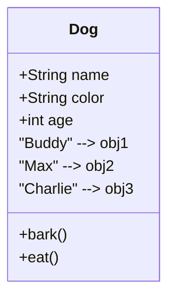
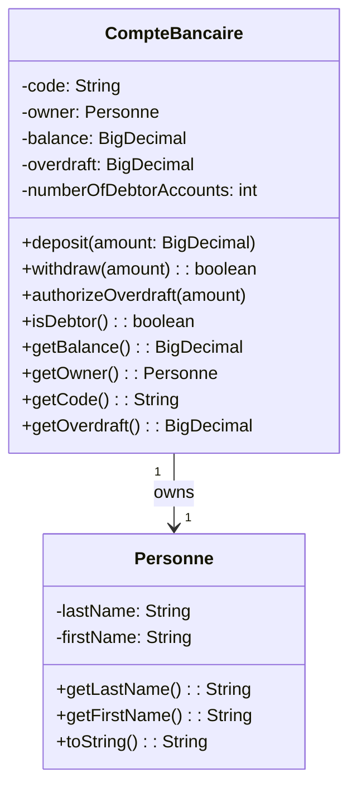
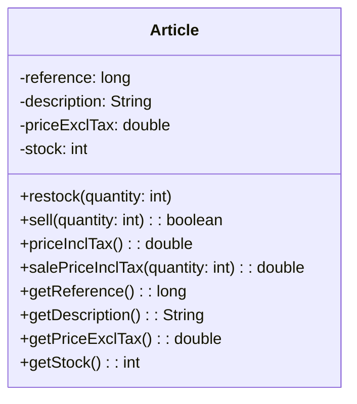
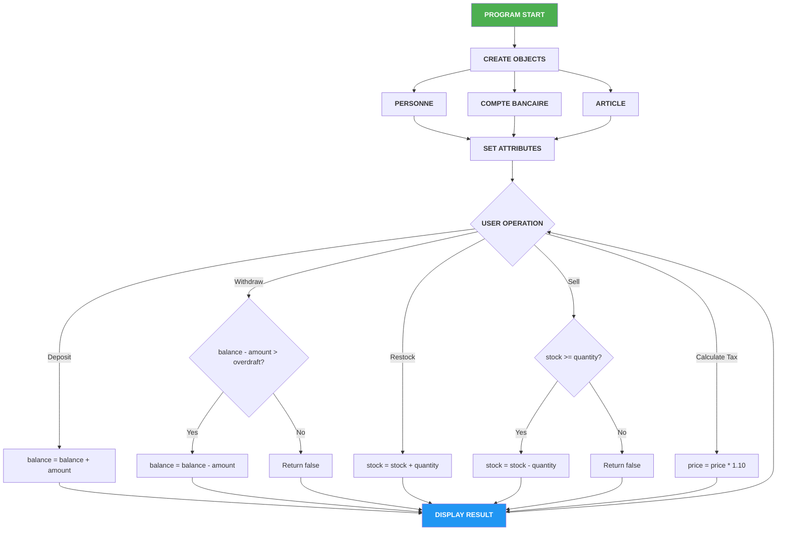

# 🏦💰 Java OOP Bank & Store Management System

## 🎓 Complete Enterprise-Grade Learning Guide

<p align="center">
  
</p>

<div align="center">


</div>

---

<p align="center">
  
</p>

---

## 📋 Table of Contents

1. [Project Overview](#1-project-overview)
2. [Introduction to Java](#2-introduction-to-java)
3. [Understanding OOP](#3-understanding-object-oriented-programming)
4. [Project Features](#4-project-features)
5. [System Requirements](#5-system-requirements)
6. [Installation Guide](#6-installation-guide)
7. [Project Architecture](#7-project-architecture)
8. [UML Class Diagrams](#8-uml-class-diagrams)
9. [Running the Application](#9-running-the-application)
10. [Comprehensive Tutorial](#10-comprehensive-tutorial)
11. [Detailed Code Analysis](#11-detailed-code-analysis)
12. [OOP Principles Deep Dive](#12-oop-principles-deep-dive)
13. [Best Practices](#13-best-practices)
14. [Troubleshooting](#14-troubleshooting)
15. [Frequently Asked Questions](#15-frequently-asked-questions)
16. [Contributing](#16-contributing)
17. [License](#17-license)

---

## 1. Project Overview

<p align="center">
  
</p>

### 1.1 Welcome to This Project

Welcome to the **Java OOP Bank & Store Management System** - a comprehensive educational project designed to teach Object-Oriented Programming fundamentals through practical, real-world applications.

This project demonstrates two complete business applications:

| Application | Purpose | Key Operations |
|-------------|---------|----------------|
| 🏦 Banking System | Bank account management | Create accounts, deposit, withdraw, overdraft, debtor tracking |
| 🛒 Store System | Product inventory management | Create products, restock, sell, tax calculation |

### 1.2 Learning Objectives

By the end of this project, you will understand:

- ✅ How to create and use Classes and Objects
- ✅ Principles of Encapsulation
- ✅ Constructors and their types
- ✅ Static vs Instance members
- ✅ Getter and Setter methods
- ✅ Method overloading
- ✅ Data type selection (BigDecimal for money)
- ✅ Package organization

### 1.3 Target Audience

This project is designed for:

| Audience | Description |
|----------|-------------|
| 🎓 Programming beginners | Never wrote code before |
| 📚 Java learners | Want to understand OOP |
| 👨‍🏫 Teachers | Teaching OOP concepts |
| 🔄 Career changers | Moving into programming |

---

## 2. Introduction to Java

<p align="center">
  
</p>

### 2.1 What is Java?

Java is a **high-level, class-based, object-oriented programming language** designed to have as few implementation dependencies as possible.

### 2.2 Why Java?

| Feature | Benefit |
|---------|---------|
| **Write Once, Run Anywhere** | Platform independent |
| **Object-Oriented** | Modular, reusable code |
| **Automatic Memory Management** | No manual memory handling |
| **Rich API** | Built-in libraries for everything |
| **Strong Typing** | Catches errors early |
| **Large Community** | Tons of resources and support |

### 2.3 Java vs Other Languages

| Aspect | Java | Python | JavaScript |
|--------|------|--------|------------|
| Typing | Static | Dynamic | Dynamic |
| Compiled | Yes | No | No |
| OOP | Pure | Multi-paradigm | Prototype-based |
| Use Case | Enterprise, Android | AI, Web | Web |

### 2.4 Your First Java Program

```java
public class HelloWorld {
    public static void main(String[] args) {
        System.out.println("Hello, World!");
    }
}
```

### 2.5 Basic Java Syntax

| Concept | Example |
|---------|---------|
| Print | `System.out.println("text");` |
| Variable | `int age = 25;` |
| If Statement | `if (age > 18) { ... }` |
| Loop | `for (int i = 0; i < 10; i++) { }` |
| Method | `public void greet() { }` |
| Class | `public class Person { }` |

---

## 3. Understanding Object-Oriented Programming

<p align="center">
  
</p>

### 3.1 What is OOP?

Object-Oriented Programming (OOP) is a programming paradigm based on the concept of **objects**, which can contain data (attributes) and code (methods).

### 3.2 Core OOP Concepts

| Concept | Description |
|---------|-------------|
| **Encapsulation** | Bundling data and methods together |
| **Inheritance** | Creating new classes from existing ones |
| **Polymorphism** | Same interface, different implementations |
| **Abstraction** | Hiding complex details |

### 3.3 Classes vs Objects



**Class** = Blueprint / Template
**Object** = Actual instance created from the class

### 3.4 Real-World Analogy

```
CLASS = RECIPE
├── Ingredients (Attributes)
│   ├── flour: 2 cups
│   ├── sugar: 1 cup
│   └── eggs: 3
└── Instructions (Methods)
    ├── mix()
    ├── bake()
    └── cool()

OBJECT = THE CAKE
├── Actual values
│   ├── flour: 2 cups (actual)
│   ├── sugar: 1 cup (actual)
│   └── eggs: 3 (actual)
└── Result
    └── 🎂 Delicious Cake!
```

---

## 4. Project Features

### 4.1 Banking System Features

<p align="center">
  
</p>

| Feature | Description | Example |
|---------|-------------|---------|
| ✅ Create Account | Open new bank accounts | Create ACC-001 for John |
| ✅ Deposit | Add money | Add $500 to account |
| ✅ Withdraw | Remove money | Take $200 from account |
| ✅ Overdraft | Set borrowing limit | Allow up to $500 debt |
| ✅ Track Debtors | Count negative accounts | Monitor accounts < $0 |
| ✅ View Balance | Check current balance | Show $1,500 |
| ✅ View Owner | See account owner | Show John Smith |

### 4.2 Store System Features

<p align="center">
  
</p>

| Feature | Description | Example |
|---------|-------------|---------|
| ✅ Create Product | Add new items | Add iPhone 15 |
| ✅ Restock | Increase inventory | Add 50 more phones |
| ✅ Sell | Decrease inventory | Sell 3 phones |
| ✅ Calculate Tax | Add 10% VAT | $799 → $878.90 |
| ✅ Bulk Price | Multiple items total | 5 × $878.90 = $4,394.50 |
| ✅ View Stock | Check quantity | Show 47 remaining |

---

## 5. System Requirements

### 5.1 Software Requirements

| Requirement | Minimum | Recommended |
|-------------|---------|-------------|
| Java JDK | 17 | 21 |
| RAM | 4 GB | 8 GB |
| Disk Space | 500 MB | 1 GB |
| OS | Windows 10 / macOS / Linux | Latest |

### 5.2 Required Tools

| Tool | Purpose | Download Link |
|------|---------|----------------|
| Java JDK 17+ | Compile and run Java | [Download](https://www.oracle.com/java/technologies/downloads/) |
| VS Code | Code editor | [Download](https://code.visualstudio.com/) |
| Git | Version control | [Download](https://git-scm.com/) |

### 5.3 Verify Installation

```bash
# Check Java version
java -version

# Should show:
# java version "17.0.x" or higher

# Check Java compiler
javac -version

# Should show:
# javac 17.0.x or higher
```

---

## 6. Installation Guide

### 6.1 Step-by-Step Installation

#### Step 1: Download the Project

1. Navigate to: `https://github.com/Lagmouchyoussef/java-oop-bank-store---Simple-and-descriptive`
2. Click the green **"Code"** button
3. Select **"Download ZIP"**
4. Save the file to your desired location

#### Step 2: Extract the ZIP

1. Right-click on the downloaded ZIP file
2. Select **"Extract All"**
3. Choose a destination folder
4. Click **"Extract"**

#### Step 3: Open in IDE

**VS Code:**
```
1. Launch VS Code
2. File → Open Folder
3. Navigate to the extracted folder
4. Click "Select Folder"
5. Install "Java Extension Pack" when prompted
```

**IntelliJ IDEA:**
```
1. Launch IntelliJ IDEA
2. File → Open
3. Navigate to the folder
4. Click "OK"
5. Wait for indexing to complete
```

---

## 7. Project Architecture

### 7.1 Directory Structure

```
java-oop-bank-store/
│
├── 📂 src/
│   ├── 📂 ma/
│   │   ├── 📂 emsi/
│   │   │   ├── 📂 projets/
│   │   │   │   ├── 📂 banque/
│   │   │   │   │   ├── CompteBancaire.java
│   │   │   │   │   └── Personne.java
│   │   │   │   │
│   │   │   │   └── 📂 magasin/
│   │   │   │       └── Article.java
│   │   │   │
│   │   │   └── (other packages)
│   │   │
│   │   └── (other packages)
│   │
│   └── Main.java
│
├── 📄 README.md
├── 📦 TP2.iml
└── 📜 .gitignore
```

### 7.2 Package Explanation

| Package | Purpose |
|---------|---------|
| `ma.emsi.projets.banque` | Banking system classes |
| `ma.emsi.projets.magasin` | Store system classes |

---

## 8. UML Class Diagrams

### 8.1 Banking System Class Diagram



### 8.2 Store System Class Diagram



### 8.3 System Flow Diagram



---

## 9. Running the Application

### 9.1 Using Command Line

#### Compile the Project

```bash
# Navigate to project directory
cd /path/to/java-oop-bank-store

# Compile all Java files
javac -d out src/ma/emsi/projets/banque/*.java
javac -d out src/ma/emsi/projets/magasin/*.java

# Run the Banking System
java -cp out ma.emsi.projets.banque.CompteBancaire

# Run the Store System
java -cp out ma.emsi.projets.magasin.Article
```

### 9.2 Using VS Code

1. Open the project folder in VS Code
2. Navigate to the desired Java file:
   - `src/ma/emsi/projets/banque/CompteBancaire.java`
   - `src/ma/emsi/projets/magasin/Article.java`
3. Right-click anywhere in the code
4. Select **"Run Java"**
5. Or simply press **F5**

### 9.3 Using IntelliJ IDEA

1. Open the project in IntelliJ IDEA
2. Right-click on the desired Java file
3. Select **"Run 'ClassName.main()'"**
4. Or press **Shift + F10**

---

## 10. Comprehensive Tutorial

### Part A: Store Management System Tutorial

#### Lesson A1: Understanding the Article Class

The Article class represents a product in a store. Each article has:

- **reference**: Unique identifier (like a barcode)
- **description**: What the product is called
- **priceExclTax**: Price without tax
- **stock**: How many items are available

#### Lesson A2: Creating Your First Product

```java
// Create a new smartphone product
Article smartphone = new Article(
    1001,              // reference (unique ID)
    "iPhone 15",       // description (name)
    799.99,           // priceExclTax (without tax)
    50                // stock (quantity in store)
);

// Now we have created our first object!
System.out.println("Created: " + smartphone.getDescription());
System.out.println("Price: $" + smartphone.getPriceExclTax());
System.out.println("Stock: " + smartphone.getStock());
```

**Output:**
```
Created: iPhone 15
Price: $799.99
Stock: 50
```

#### Lesson A3: Restocking Products

When you receive new inventory from suppliers:

```java
// Add 10 more smartphones to the store
smartphone.restock(10);

// Check the new stock
System.out.println("Updated stock: " + smartphone.getStock());
```

**Output:**
```
Updated stock: 60
```

#### Lesson A4: Selling Products

When a customer buys items:

```java
// Customer wants to buy 5 phones
boolean success = smartphone.sell(5);

if (success) {
    System.out.println("Sale completed successfully!");
    System.out.println("Remaining stock: " + smartphone.getStock());
    System.out.println("Items sold: 5");
} else {
    System.out.println("Sale failed - not enough stock!");
}
```

**Output (success case):**
```
Sale completed successfully!
Remaining stock: 55
Items sold: 5
```

**Output (fail case - not enough stock):**
```
Sale failed - not enough stock!
```

#### Lesson A5: Calculating Prices with Tax

In most countries, you need to pay VAT or sales tax:

```java
// Calculate price including 10% tax
double priceWithTax = smartphone.priceInclTax();
System.out.println("Price without tax: $" + smartphone.getPriceExclTax());
System.out.println("Tax (10%): $" + (priceWithTax - smartphone.getPriceExclTax()));
System.out.println("Price with tax: $" + priceWithTax);

// Calculate total for multiple items
double totalFor10 = smartphone.salePriceInclTax(10);
System.out.println("Total for 10 phones: $" + totalFor10);
```

**Output:**
```
Price without tax: $799.99
Tax (10%): $79.999
Price with tax: $879.989
Total for 10 phones: $8799.89
```

---

### Part B: Banking System Tutorial

#### Lesson B1: Understanding the CompteBancaire Class

The CompteBancaire class represents a bank account. Each account has:

- **code**: Unique account number
- **owner**: The person who owns the account (Personne object)
- **balance**: How much money is in the account
- **overdraft**: Maximum allowed negative balance

#### Lesson B2: Creating a Person

Before creating a bank account, we need a person:

```java
// Create a person (account owner)
Personne owner = new Personne("Smith", "John");

// Display person information
System.out.println("Owner created:");
System.out.println("First Name: " + owner.getFirstName());
System.out.println("Last Name: " + owner.getLastName());
System.out.println("Full Name: " + owner.toString());
```

**Output:**
```
Owner created:
First Name: John
Last Name: Smith
Full Name: Smith John
```

#### Lesson B3: Creating a Bank Account

Now create the account:

```java
// Create a new bank account
CompteBancaire account = new CompteBancaire(
    "ACC-001",                    // account code
    owner,                        // the person who owns it
    BigDecimal.valueOf(1000)      // initial balance: $1000
);

// Display account information
System.out.println("Account created:");
System.out.println("Account Code: " + account.getCode());
System.out.println("Owner: " + account.getOwner());
System.out.println("Balance: $" + account.getBalance());
System.out.println("Overdraft: $" + account.getOverdraft());
```

**Output:**
```
Account created:
Account Code: ACC-001
Owner: Smith John
Balance: $1000
Overdraft: $0
```

#### Lesson B4: Depositing Money

When you receive money (salary, gift, etc.):

```java
// Deposit $500 into the account
account.deposit(BigDecimal.valueOf(500));

System.out.println("After depositing $500:");
System.out.println("New Balance: $" + account.getBalance());
```

**Output:**
```
After depositing $500:
New Balance: $1500
```

#### Lesson B5: Withdrawing Money

When you need to spend money:

```java
// Try to withdraw $200
boolean success = account.withdraw(BigDecimal.valueOf(200));

if (success) {
    System.out.println("Withdrawal successful!");
    System.out.println("Amount withdrawn: $200");
    System.out.println("New Balance: $" + account.getBalance());
} else {
    System.out.println("Withdrawal failed!");
    System.out.println("Insufficient funds or overdraft limit exceeded");
}
```

**Output:**
```
Withdrawal successful!
Amount withdrawn: $200
New Balance: $1300
```

#### Lesson B6: Setting Overdraft

Overdraft allows you to go negative up to a certain limit:

```java
// Allow this account to go up to $500 negative
account.authorizeOverdraft(BigDecimal.valueOf(500));

System.out.println("Overdraft authorized!");
System.out.println("Overdraft limit: $" + account.getOverdraft());

// Now try to withdraw more than the balance
boolean largeWithdrawal = account.withdraw(BigDecimal.valueOf(1500));

System.out.println("After withdrawing $1500:");
System.out.println("Success: " + largeWithdrawal);
System.out.println("Balance: $" + account.getBalance());
```

**Output:**
```
Overdraft authorized!
Overdraft limit: $500
After withdrawing $1500
Success: true
Balance: $-200
```

#### Lesson B7: Checking Debtor Status

Check if an account owes money to the bank:

```java
// Check if account is in debt
if (account.isDebtor()) {
    System.out.println("⚠️ WARNING: Account is in debt!");
    System.out.println("Current balance: $" + account.getBalance());
} else {
    System.out.println("✅ Account is healthy");
    System.out.println("Current balance: $" + account.getBalance());
}
```

**Output:**
```
⚠️ WARNING: Account is in debt!
Current balance: $-200
```

---

## 11. Detailed Code Analysis

### 11.1 Article.java - Complete Analysis

```java
package ma.emsi.projets.magasin;

/**
 * Article class represents a product in a store.
 * This class demonstrates basic OOP concepts including:
 * - Encapsulation
 * - Constructors
 * - Methods
 * - Getters
 */
public class Article {
    
    // ═══════════════════════════════════════════════════════════
    // ATTRIBUTES / FIELDS / PROPERTIES
    // These represent the DATA that each Article object will have
    // ═══════════════════════════════════════════════════════════
    
    /** Unique identifier for the article (like a barcode) */
    private long reference;
    
    /** Name/description of the product */
    private String description;
    
    /** Price without tax (base price) */
    private double priceExclTax;
    
    /** Quantity available in stock */
    private int stock;
    
    // ═══════════════════════════════════════════════════════════
    // CONSTRUCTORS
    // Constructors are special methods called when creating an object
    // ═══════════════════════════════════════════════════════════
    
    /**
     * Constructor to create a new Article with all attributes
     * @param reference Unique identifier
     * @param description Product name
     * @param priceExclTax Price without tax
     * @param stock Initial quantity
     */
    public Article(long reference, String description, 
                   double priceExclTax, int stock) {
        this.reference = reference;
        this.description = description;
        this.priceExclTax = priceExclTax;
        this.stock = stock;
    }
    
    // ═══════════════════════════════════════════════════════════
    // METHODS / FUNCTIONS
    // These represent the ACTIONS that an Article can perform
    // ═══════════════════════════════════════════════════════════
    
    /**
     * Add stock to the article
     * @param numberOfUnits Quantity to add
     */
    public void restock(int numberOfUnits) {
        if (numberOfUnits > 0) {
            this.stock += numberOfUnits;
            System.out.println("Restocked " + numberOfUnits + " units.");
            System.out.println("New stock: " + this.stock);
        } else {
            System.out.println("Invalid quantity!");
        }
    }
    
    /**
     * Sell (remove) stock from the article
     * @param numberOfUnits Quantity to sell
     * @return true if sale successful, false if not enough stock
     */
    public boolean sell(int numberOfUnits) {
        // Check if we have enough stock
        if (numberOfUnits <= this.stock && numberOfUnits > 0) {
            this.stock -= numberOfUnits;
            System.out.println("Sold " + numberOfUnits + " units.");
            return true;
        } else {
            System.out.println("Cannot sell! Not enough stock.");
            return false;
        }
    }
    
    /**
     * Calculate price including 10% tax
     * @return Price with tax
     */
    public double priceInclTax() {
        return this.priceExclTax * 1.10;
    }
    
    /**
     * Calculate total price for multiple items including tax
     * @param quantity Number of items
     * @return Total price with tax
     */
    public double salePriceInclTax(int quantity) {
        return (this.priceExclTax * quantity) * 1.10;
    }
    
    // ═══════════════════════════════════════════════════════════
    // GETTER METHODS
    // These provide READ-ONLY access to private attributes
    // ═══════════════════════════════════════════════════════════
    
    public long getReference() { return this.reference; }
    public String getDescription() { return this.description; }
    public double getPriceExclTax() { return this.priceExclTax; }
    public int getStock() { return this.stock; }
}
```

### 11.2 CompteBancaire.java - Complete Analysis

```java
package ma.emsi.projets.banque;

import java.math.BigDecimal;

/**
 * CompteBancaire represents a bank account.
 * This class demonstrates advanced OOP concepts including:
 * - Static variables
 * - BigDecimal for precise calculations
 * - Multiple constructors
 * - Method overloading concepts
 */
public class CompteBancaire {
    
    // ═══════════════════════════════════════════════════════════
    // STATIC VARIABLE
    // Shared by ALL instances of this class
    // ═══════════════════════════════════════════════════════════
    
    /** Counter for all debtor accounts across the bank */
    private static int numberOfDebtorAccounts = 0;
    
    // ═══════════════════════════════════════════════════════════
    // INSTANCE VARIABLES
    // Each object has its own copy of these
    // ═══════════════════════════════════════════════════════════
    
    /** Unique account identifier */
    private String code;
    
    /** The person who owns this account */
    private Personne owner;
    
    /** Current balance (can be negative!) */
    private BigDecimal balance;
    
    /** Maximum allowed negative balance */
    private BigDecimal overdraft;
    
    // ═══════════════════════════════════════════════════════════
    // CONSTRUCTORS
    // ═══════════════════════════════════════════════════════════
    
    /**
     * Full constructor with initial balance
     * @param code Account number
     * @param owner Account owner
     * @param initialBalance Starting balance
     */
    public CompteBancaire(String code, Personne owner, 
                          BigDecimal initialBalance) {
        this.code = code;
        this.owner = owner;
        this.balance = initialBalance;
        this.overdraft = BigDecimal.ZERO;
        
        // If starting with negative balance, count as debtor
        if (initialBalance.compareTo(BigDecimal.ZERO) < 0) {
            numberOfDebtorAccounts++;
        }
    }
    
    /**
     * Constructor with default zero balance
     * @param code Account number
     * @param owner Account owner
     */
    public CompteBancaire(String code, Personne owner) {
        this(code, owner, BigDecimal.ZERO);
    }
    
    // ═══════════════════════════════════════════════════════════
    // METHODS
    // ═══════════════════════════════════════════════════════════
    
    /**
     * Deposit money into account
     * @param amount Amount to deposit (must be positive)
     */
    public void deposit(BigDecimal amount) {
        if (amount != null && amount.compareTo(BigDecimal.ZERO) > 0) {
            this.balance = this.balance.add(amount);
            System.out.println("Deposited: $" + amount);
            System.out.println("New balance: $" + this.balance);
        } else {
            System.out.println("Invalid deposit amount!");
        }
    }
    
    /**
     * Withdraw money from account
     * @param amount Amount to withdraw
     * @return true if successful, false if insufficient funds
     */
    public boolean withdraw(BigDecimal amount) {
        if (amount == null || amount.compareTo(BigDecimal.ZERO) <= 0) {
            System.out.println("Invalid withdrawal amount!");
            return false;
        }
        
        // Calculate what balance would be after withdrawal
        BigDecimal potentialBalance = this.balance.subtract(amount);
        
        // Check if within overdraft limit
        // Balance must not go below negative of overdraft
        BigDecimal minimumAllowed = this.overdraft.negate();
        
        if (potentialBalance.compareTo(minimumAllowed) >= 0) {
            this.balance = potentialBalance;
            
            // Check if now in debt
            if (this.balance.compareTo(BigDecimal.ZERO) < 0) {
                numberOfDebtorAccounts++;
            }
            
            System.out.println("Withdrawn: $" + amount);
            System.out.println("New balance: $" + this.balance);
            return true;
        } else {
            System.out.println("Withdrawal failed! Would exceed overdraft limit.");
            return false;
        }
    }
    
    /**
     * Set/authorize overdraft limit
     * @param amount Maximum allowed negative balance
     */
    public void authorizeOverdraft(BigDecimal amount) {
        if (amount != null && amount.compareTo(BigDecimal.ZERO) > 0) {
            this.overdraft = amount;
            System.out.println("Overdraft authorized: $" + amount);
        }
    }
    
    /**
     * Check if account is in debt (negative balance)
     * @return true if balance is negative
     */
    public boolean isDebtor() {
        return this.balance.compareTo(BigDecimal.ZERO) < 0;
    }
    
    // ═══════════════════════════════════════════════════════════
    // GETTER METHODS
    // ═══════════════════════════════════════════════════════════
    
    public String getCode() { return this.code; }
    public Personne getOwner() { return this.owner; }
    public BigDecimal getBalance() { return this.balance; }
    public BigDecimal getOverdraft() { return this.overdraft; }
    
    public static int getNumberOfDebtorAccounts() { 
        return numberOfDebtorAccounts; 
    }
}
```

### 11.3 Personne.java - Complete Analysis

```java
package ma.emsi.projets.banque;

/**
 * Personne represents a person (account owner).
 * Simple class demonstrating basic OOP principles.
 */
public class Personne {
    
    private String lastName;
    private String firstName;
    
    public Personne(String lastName, String firstName) {
        this.lastName = lastName;
        this.firstName = firstName;
    }
    
    public String getLastName() { return this.lastName; }
    public String getFirstName() { return this.firstName; }
    
    @Override
    public String toString() {
        return lastName + " " + firstName;
    }
}
```

---

## 12. OOP Principles Deep Dive

### 12.1 Encapsulation

**Definition:** Bundling data (attributes) and methods together while restricting direct access to some components.

```java
// WRONG - Direct access to private data!
account.balance = 1000000; // ❌ DANGEROUS!

// RIGHT - Using public methods
account.deposit(BigDecimal.valueOf(100)); // ✅ SAFE
```

**Benefits:**
- Data protection
- Code maintainability
- Flexibility to change internal implementation

### 12.2 Constructors

**Definition:** Special methods used to initialize objects.

```java
// No-argument constructor
public Article() { }

// Parameterized constructor
public Article(long ref, String desc) {
    this.reference = ref;
    this.description = desc;
}
```

### 12.3 Static vs Instance

| Aspect | Instance | Static |
|--------|----------|--------|
| Belongs to | Object | Class |
| Created | With `new` | At class load |
| Access | `object.method()` | `Class.method()` |
| Example | `account.balance` | `CompteBancaire.numberOfDebtorAccounts` |

### 12.4 Getters and Setters

```java
// Getter - Read data
public BigDecimal getBalance() {
    return this.balance;
}

// Setter - Modify data (with validation)
public void setBalance(BigDecimal newBalance) {
    if (newBalance != null) {
        this.balance = newBalance;
    }
}
```

---

## 13. Best Practices

### 13.1 Naming Conventions

| Type | Convention | Example |
|------|------------|---------|
| Class | PascalCase | `CompteBancaire` |
| Method | camelCase | `depositMoney()` |
| Variable | camelCase | `accountBalance` |
| Constant | UPPER_SNAKE | `MAX_OVERDRAFT` |

### 13.2 Code Organization

```
1. Package declaration
2. Imports
3. Class declaration
   a. Static variables
   b. Instance variables
   c. Constructors
   d. Public methods
   e. Private methods
   f. Getters/Setters
```

### 13.3 Comments

```java
/**
 * Brief description of what this class does.
 * 
 * @author Your Name
 * @version 1.0
 * @since 2026
 */
public class Article { }
```

---

## 14. Troubleshooting

### 14.1 Common Issues

| Issue | Solution |
|-------|----------|
| "Cannot find symbol" | Check import statements |
| "Class not found" | Verify classpath |
| "NullPointerException" | Check object initialization |
| "NumberFormatException" | Validate input types |

### 14.2 Java Errors Explained

| Error | Meaning | Fix |
|-------|---------|-----|
| `Syntax error` | Code doesn't follow Java rules | Check spelling/symbols |
| `Type mismatch` | Wrong data type | Check variable types |
| `NullPointerException` | Using null object | Initialize objects |
| `ArrayIndexOutOfBounds` | Accessing invalid index | Check loop bounds |

---

## 15. Frequently Asked Questions

### Q1: I'm completely new to programming. Is this for me?
**A:** Absolutely! This project starts from the basics and explains everything.

### Q2: What's the difference between Java and JavaScript?
**A:** They're completely different! Java = apps/games/Android, JavaScript = websites.

### Q3: Why use BigDecimal instead of double for money?
**A:** Because double can have tiny errors (0.1 + 0.2 = 0.30000000000000004). BigDecimal is exact!

### Q4: What does @Override mean?
**A:** It tells Java you're replacing a default method with your own version.

### Q5: How long does it take to learn Java?
**A:** Basic understanding: 2-4 weeks. Comfortable: 2-3 months. Professional: 1+ year.

### Q6: Can I use this for my school project?
**A:** Yes! This is open source. Just mention the source.

---

## 16. Contributing

Contributions are welcome! Please feel free to submit a Pull Request.

---

## 17. License

This project is licensed under the MIT License.

---

<p align="center">
  
</p>

---

<p align="center">
  <strong>⭐ Don't forget to star this repository if you found it useful!</strong>
</p>

<p align="center">
  Made with ❤️
</p>
