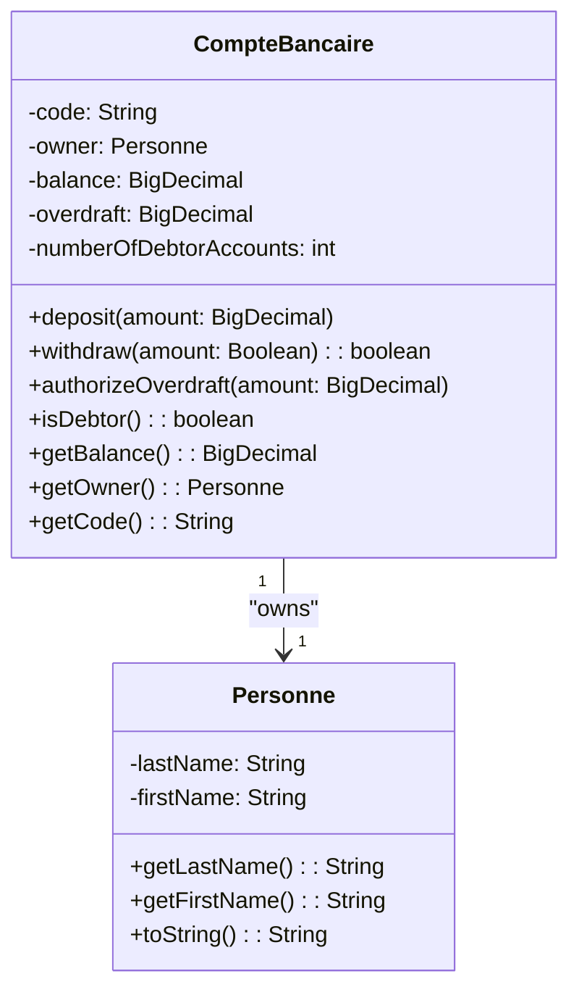
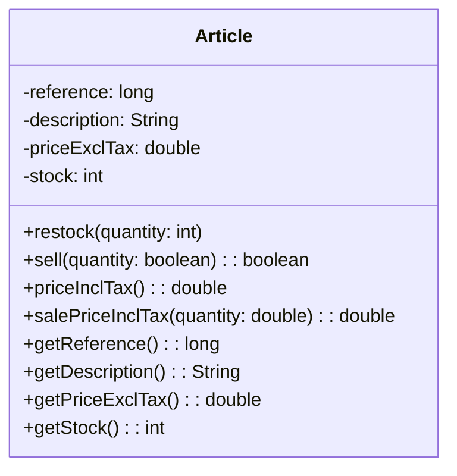
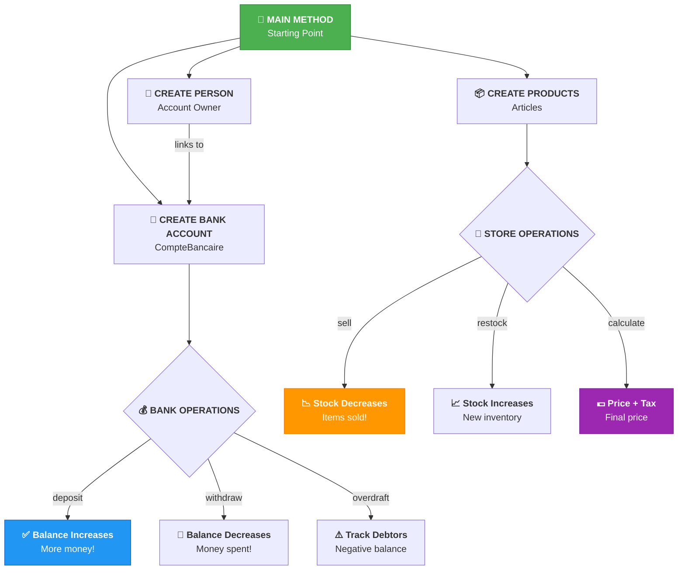

# 🏦💰 Java OOP Bank & Store Management System

<p align="center">
  
</p>

<div align="center">


</div>

---

<p align="center">
  
</p>

---

<div align="center">

[](https://www.emsi.ma/)
[]()
[]()

</div>

---

<!-- ═══════════════════════════════════════════════════════════════════════════════ -->
<!-- 📋 TABLE OF CONTENTS -->
<!-- ═══════════════════════════════════════════════════════════════════════════════ -->

<details>
  <summary align="center">
    <h2>📋 📑 Table of Contents ⭐</h2>
  </summary>
  
  <div align="center">
  
  | Section | Description |
  |---------|-------------|
  | [🌟 1. Welcome](#1--welcome) | Project overview and introduction |
  | [💻 2. What is Java?](#2--what-is-java) | Java explained for complete beginners |
  | [🎓 3. What is OOP?](#3--what-is-object-oriented-programming) | Object-Oriented Programming explained |
  | [🛠️ 4. Project Features](#4--project-features) | What this project can do |
  | [📦 5. Prerequisites](#5--prerequisites) | What you need to install |
  | [💾 6. Installation](#6--installation) | Step-by-step setup guide |
  | [🏗️ 7. Project Structure](#7--project-structure) | File organization |
  | [📊 8. UML Diagrams](#8--uml-diagrams) | Visual class diagrams (Mermaid) |
  | [🚀 9. How to Run](#9--how-to-run) | Running the project |
  | [📖 10. Tutorial](#10--tutorial) | Complete step-by-step guide |
  | [🔍 11. Code Explanation](#11--code-explanation) | Detailed code breakdown |
  | [🧠 12. OOP Concepts](#12--oop-concepts) | OOP concepts explained simply |
  | [❓ 13. FAQ](#13--faq) | Frequently asked questions |
  | [👨‍💻 14. Author](#14--author) | About the developer |
  | [📄 15. License](#15--license) | Project license |
  
  </div>
</details>

---

<!-- ═══════════════════════════════════════════════════════════════════════════════ -->
<!-- 1. WELCOME -->
<!-- ═══════════════════════════════════════════════════════════════════════════════ -->

## 🌟 1. Welcome

<p align="center">
  
</p>

### 🎉 Welcome to the Ultimate Java OOP Learning Project! 🎉

This is a **comprehensive educational project** designed to teach you **Object-Oriented Programming (OOP)** from scratch. Whether you've never written a single line of code in your life, or you're looking to strengthen your OOP fundamentals, this project is perfect for you!

---

### 📱 💼 What You'll Build

<div align="center">

| 🏦 Banking System | 🛒 Store System |
|-------------------|-----------------|
|  |  |
| Manage bank accounts | Manage products |
| Deposit & Withdraw | Buy & Sell items |
| Track debtors | Calculate prices |
| Overdraft management | Inventory tracking |

</div>

---

<!-- ═══════════════════════════════════════════════════════════════════════════════ -->
<!-- 2. WHAT IS JAVA -->
<!-- ═══════════════════════════════════════════════════════════════════════════════ -->

## 💻 2. What is Java?

<p align="center">
  
</p>

### 🤔 Imagine This...

You're teaching a robot 🤖 to make a sandwich. You need to give it **step-by-step instructions**:

```
1. Get bread 🫓
2. Get peanut butter 🥜
3. Spread peanut butter on bread
4. Get jelly 🍇
5. Spread jelly on bread
6. Put another bread on top
7. Give sandwich to person 🙋
```

**Java is exactly that!** It's a language where you give the computer step-by-step instructions!

---

### 🌍 Why Java is Amazing?

<div align="center">

| ✨ Feature | 💡 Explanation | 🖼️ Icon |
|------------|---------------|----------|
| **Write Once, Run Anywhere** | One code runs on Windows, Mac, Linux, phones! | 🖥️📱💻 |
| **Used by Giants** | Google, Amazon, Netflix, Banks all use Java! | 🏢🏦🌐 |
| **Easy to Learn** | English-like words, very readable! | 📖✏️ |
| **High Demand** | Java developers earn great salaries! | 💰💵 |
| **Super Reliable** | Banks trust Java for their money systems! | 🔒🏦 |

</div>

---

### 🆚 Java vs Other Things

<div align="center">

```
┌─────────────────────────────────────────────────────────────────┐
│                     HUMAN vs COMPUTER LANGUAGE                   │
├─────────────────────────────────────────────────────────────────┤
│                                                                  │
│  🗣️ Human: "Hello, how are you?"                               │
│  💻 Computer: System.out.println("Hello, how are you?");      │
│                                                                  │
│  🗣️ Human: "If I'm hungry, eat food"                          │
│  💻 Computer: if (hungry) { eatFood(); }                       │
│                                                                  │
│  🗣️ Human: "Repeat this 5 times"                              │
│  💻 Computer: for (int i = 0; i < 5; i++) { ... }             │
│                                                                  │
└─────────────────────────────────────────────────────────────────┘
```

</div>

---

<!-- ═══════════════════════════════════════════════════════════════════════════════ -->
<!-- 3. WHAT IS OOP -->
<!-- ═══════════════════════════════════════════════════════════════════════════════ -->

## 🎓 3. What is Object-Oriented Programming?

<p align="center">
  
</p>

### 🎯 The Simple Explanation

**OOP** is just a way to organize code that matches how real life works!

---

### 🐕 Real-World Example: Dogs!

<div align="center">

```
┌────────────────────────────────────────────────────────────────────┐
│                         THE DOG BLUEPRINT                           │
│                           (CLASS)                                   │
├────────────────────────────────────────────────────────────────────┤
│                                                                    │
│    PROPERTIES (What a dog HAS):                                    │
│    ───────────────────────────                                     │
│    🐕 name     = "Buddy"                                           │
│    🎨 color    = "Golden"                                          │
│    📅 age      = 3                                                 │
│    🐶 breed    = "Golden Retriever"                                │
│                                                                    │
│    ACTIONS (What a dog CAN DO):                                    │
│    ───────────────────────────                                     │
│    🗣️ bark()   → "Woof! Woof!"                                     │
│    🍖 eat()    → Chewing...                                        │
│    😴 sleep()  → ZZZ... ZZZ...                                     │
│    🎾 play()   → Running around!                                   │
│                                                                    │
└────────────────────────────────────────────────────────────────────┘

    BUDDY (Object #1)           MAX (Object #2)
    ───────────────             ──────────────
    name: "Buddy"              name: "Max"
    color: "Golden"            color: "Black"
    age: 3                     age: 5
    breed: "Retriever"         breed: "Labrador"
```

</div>

---

### 📦 In Our Project

<div align="center">

```
┌─────────────────────────────────────────────────────────────────┐
│                    ARTICLE (THE CLASS)                           │
│                  (Blueprint for Products)                        │
├─────────────────────────────────────────────────────────────────┤
│                                                                  │
│  Every article HAS:                                              │
│  ───────────────                                                 │
│    📋 reference (unique ID)                                     │
│    📝 description (name)                                        │
│    💵 priceExclTax (cost)                                       │
│    📦 stock (quantity)                                          │
│                                                                  │
│  Every article CAN:                                              │
│  ───────────────                                                 │
│    ➕ restock() → Add more items                                 │
│    ➖ sell()    → Remove items (when sold)                      │
│    💰 priceInclTax() → Price + 10% tax                          │
│                                                                  │
└─────────────────────────────────────────────────────────────────┘

  📱 iPhone 15      💻 MacBook Pro       📺 Samsung TV
  ─────────────    ───────────────     ─────────────
  ref: 1001        ref: 1002           ref: 1003
  price: $999      price: $1499        price: $599
  stock: 50        stock: 25           stock: 100

  (All different OBJECTS, same ARTICLE blueprint!)
```

</div>

---

<!-- ═══════════════════════════════════════════════════════════════════════════════ -->
<!-- 4. PROJECT FEATURES -->
<!-- ═══════════════════════════════════════════════════════════════════════════════ -->

## 🛠️ 4. Project Features

<p align="center">
  
</p>

---

### 🏦 Banking System Features

<div align="center">

| Feature | Icon | Description |
|---------|------|-------------|
| ✅ Create Account |  | Open new bank accounts |
| ✅ Deposit Money |  | Add money to account |
| ✅ Withdraw Money |  | Take money out |
| ✅ Overdraft |  | Set borrowing limit |
| ✅ Track Debtors |  | Monitor negative accounts |

</div>

---

### 🛒 Store System Features

<div align="center">

| Feature | Icon | Description |
|---------|------|-------------|
| ✅ Create Product |  | Add new items |
| ✅ Restock |  | Add inventory |
| ✅ Sell |  | Process sales |
| ✅ Calculate Tax |  | Price with 10% tax |
| ✅ Bulk Pricing |  | Multi-item totals |

</div>

---

<!-- ═══════════════════════════════════════════════════════════════════════════════ -->
<!-- 5. PREREQUISITES -->
<!-- ═══════════════════════════════════════════════════════════════════════════════ -->

## 📦 5. Prerequisites

<p align="center">
  
</p>

### 🎁 Everything You Need is FREE!

<div align="center">

| Tool | Version | Purpose | Download Link |
|------|---------|---------|----------------|
|  **Java JDK** | 17+ | The programming language | [Download 🔽](https://www.oracle.com/java/technologies/downloads/) |
|  **VS Code** | Latest | Code editor | [Download 🔽](https://code.visualstudio.com/) |
|  **Git** | Latest | Version control | [Download 🔽](https://git-scm.com/) |

</div>

---

### ⚠️ Verify Java Installation

```bash
# Type this in terminal/command prompt:
java -version
```

**You should see something like:**
```
java version "17.0.x"
Java(TM) SE Runtime Environment (build 17.0.x+...)
```

---

<!-- ═══════════════════════════════════════════════════════════════════════════════ -->
<!-- 6. INSTALLATION -->
<!-- ═══════════════════════════════════════════════════════════════════════════════ -->

## 💾 6. Installation

<p align="center">
  
</p>

### 📥 Step 1: Download

```
🌐 Go to: https://github.com/Lagmouchyoussef/java-oop-bank-store---Simple-and-descriptive
👆 Click the green "Code" button
📥 Click "Download ZIP"
💾 Save to your Desktop
```

### 📂 Step 2: Extract

```
📁 Right-click the ZIP file
🗑️ Select "Extract All"
📂 Choose a folder location
✅ Click "Extract"
```

### 💻 Step 3: Open in Editor

#### Option A: VS Code (Recommended) 🌟
```
1. Open VS Code
2. Click File → Open Folder
3. Select the extracted folder
4. Install "Java Extension Pack" if asked
```

#### Option B: IntelliJ IDEA ⚡
```
1. Open IntelliJ IDEA
2. Click File → Open
3. Select the folder
4. Wait for loading...
```

---

<!-- ═══════════════════════════════════════════════════════════════════════════════ -->
<!-- 7. PROJECT STRUCTURE -->
<!-- ═══════════════════════════════════════════════════════════════════════════════ -->

## 🏗️ 7. Project Structure

<p align="center">
  
</p>

### 📁 File Tree

```
📦 java-oop-bank-store
│
├── 📂 src/
│   ├── 📂 ma/emsi/projets/
│   │   ├── 📂 banque/          🏦 Bank Module
│   │   │   ├── 💰 CompteBancaire.java    ← Main bank code
│   │   │   └── 👤 Personne.java         ← Person class
│   │   │
│   │   └── 📂 magasin/          🛒 Store Module
│   │       └── 📦 Article.java          ← Product code
│   │
│   └── 🚀 Main.java             ← Entry point
│
├── 📄 README.md                 ← You are here! 📍
├── 📦 TP2.iml                  ← IntelliJ settings
└── 📜 .gitignore               ← Git ignore rules
```

---

### 📝 File Descriptions

<div align="center">

| File | Purpose | Icon |
|------|---------|------|
| `CompteBancaire.java` | Bank account logic | 💰🏦 |
| `Personne.java` | Person/owner info | 👤 |
| `Article.java` | Product/store logic | 📦🛒 |
| `Main.java` | Program entry point | 🚀 |

</div>

---

<!-- ═══════════════════════════════════════════════════════════════════════════════ -->
<!-- 8. UML DIAGRAMS -->
<!-- ═══════════════════════════════════════════════════════════════════════════════ -->

## 📊 8. UML Diagrams

<p align="center">
  
</p>

### 🏦 Bank Account System - Class Diagram



### 🛒 Store System - Class Diagram



### 🔄 How Everything Works Together



---

<!-- ═══════════════════════════════════════════════════════════════════════════════ -->
<!-- 9. HOW TO RUN -->
<!-- ═══════════════════════════════════════════════════════════════════════════════ -->

## 🚀 9. How to Run

<p align="center">
  
</p>

### ⌨️ Method 1: Command Line

```bash
# Navigate to project
cd path/to/your/project

# Compile (translate to computer language)
javac -d out src/ma/emsi/projets/banque/*.java
javac -d out src/ma/emsi/projets/magasin/*.java

# Run Bank System
java -cp out ma.emsi.projets.banque.CompteBancaire

# Run Store System
java -cp out ma.emsi.projets.magasin.Article
```

### 🎯 Method 2: VS Code

```
1. Open the .java file
2. Right-click anywhere
3. Click "Run Java"
4. Or press F5
```

### ⚡ Method 3: IntelliJ IDEA

```
1. Right-click on the file
2. Click "Run 'Filename.main()'"
3. Or press Shift + F10
```

---

<!-- ═══════════════════════════════════════════════════════════════════════════════ -->
<!-- 10. TUTORIAL -->
<!-- ═══════════════════════════════════════════════════════════════════════════════ -->

## 📖 10. Tutorial

<p align="center">
  
</p>

### 🛒 Part A: Store Module Tutorial

---

#### 🔰 Step 1: Create a Product

```java
// Create a smartphone product 📱
Article smartphone = new Article(
    1001,              // 📋 reference (ID)
    "iPhone 15",       // 📝 description (name)
    799.99,           // 💵 price (without tax)
    50                // 📦 stock (how many)
);
```

---

#### 🔰 Step 2: Sell Products

```java
// Customer wants to buy 3 📱
boolean success = smartphone.sell(3);

if (success) {
    System.out.println("✅ Sold 3 phones!");
    System.out.println("📦 Remaining: " + smartphone.getStock());
} else {
    System.out.println("❌ Not enough stock!");
}
```

---

#### 🔰 Step 3: Restock

```java
// Add more phones 📱📱📱
smartphone.restock(10);
System.out.println("📦 New stock: " + smartphone.getStock());
```

---

#### 🔰 Step 4: Calculate Price with Tax

```java
// 💰 Price including 10% tax
double price = smartphone.priceInclTax();
System.out.println("💵 Price with tax: $" + price);

// For 5 phones
double total = smartphone.salePriceInclTax(5);
System.out.println("💰 Total for 5: $" + total);
```

---

### 🏦 Part B: Bank Module Tutorial

---

#### 🔰 Step 1: Create a Person

```java
// Create account owner 👤
Personne owner = new Personne("Smith", "John");
System.out.println(owner.getFirstName() + " " + owner.getLastName());
// Output: John Smith
```

---

#### 🔰 Step 2: Create Bank Account

```java
// Open bank account 🏦
CompteBancaire account = new CompteBancaire(
    "ACC-001",                    // 📋 account number
    owner,                        // 👤 owner
    BigDecimal.valueOf(1000)      // 💰 starting balance: $1000
);
```

---

#### 🔰 Step 3: Deposit Money

```java
// Add $500 💰
account.deposit(BigDecimal.valueOf(500));
System.out.println("💵 New balance: $" + account.getBalance());
// Result: $1500
```

---

#### 🔰 Step 4: Withdraw Money

```java
// Take out $200 💸
boolean success = account.withdraw(BigDecimal.valueOf(200));

if (success) {
    System.out.println("✅ Withdrawn $200!");
    System.out.println("💰 Remaining: $" + account.getBalance());
} else {
    System.out.println("❌ Cannot withdraw!");
}
```

---

#### 🔰 Step 5: Set Overdraft

```java
// Allow up to $500 overdraft ⚠️
account.authorizeOverdraft(BigDecimal.valueOf(500));
System.out.println("⚠️ Overdraft limit: $" + account.getOverdraft());
```

---

#### 🔰 Step 6: Check for Debt

```java
// Check if in debt 😰
if (account.isDebtor()) {
    System.out.println("⚠️ ⚠️ Account owes money!");
} else {
    System.out.println("✅ Account is healthy!");
}
```

---

<!-- ═══════════════════════════════════════════════════════════════════════════════ -->
<!-- 11. CODE EXPLANATION -->
<!-- ═══════════════════════════════════════════════════════════════════════════════ -->

## 🔍 11. Code Explanation

<p align="center">
  
</p>

### 📦 Article.java - Complete Breakdown

```java
package ma.emsi.projets.magasin;  // 📁 Folder location

// ═══════════════════════════════════════════════════════
// 🎨 ATTRIBUTES - What each article HAS
// ═══════════════════════════════════════════════════════
private long reference;              // 📋 Unique ID (like barcode)
private String description;          // 📝 What is it called?
private double priceExclTax;        // 💵 Price before tax
private int stock;                  // 📦 How many in store?

// ═══════════════════════════════════════════════════════
// 🔨 CONSTRUCTOR - How to CREATE a new article
// ═══════════════════════════════════════════════════════
public Article(long reference, String description, 
               double priceExclTax, int stock) {
    this.reference = reference;       // Assign ID
    this.description = description;  // Assign name
    this.priceExclTax = priceExclTax; // Assign price
    this.stock = stock;              // Assign stock
}

// ═══════════════════════════════════════════════════════
// ⚡ METHODS - What an article CAN DO
// ═══════════════════════════════════════════════════════

// Add more items to inventory
public void restock(int numberOfUnits) {
    this.stock += numberOfUnits;      // stock = stock + units
}

// Sell items (if available)
public boolean sell(int numberOfUnits) {
    if (numberOfUnits <= this.stock) {  // Check if enough
        this.stock -= numberOfUnits;     // Decrease stock
        return true;                     // Sale success!
    }
    return false;                        // Not enough stock!
}

// Calculate price with 10% tax
public double priceInclTax() {
    return this.priceExclTax * 1.10;    // Add 10%
}
```

### 💰 CompteBancaire.java - Complete Breakdown

```java
package ma.emsi.projets.banque;

// ═══════════════════════════════════════════════════════
// 🌟 STATIC VARIABLE - Shared by ALL accounts!
// ═══════════════════════════════════════════════════════
private static int numberOfDebtorAccounts = 0;
// ⚠️ This, not to any belongs to CLASS single account
// All accounts share this counter!

// ═══════════════════════════════════════════════════════
// 🎨 ATTRIBUTES
// ═══════════════════════════════════════════════════════
private String code;                   // 📋 Account number
private Personne owner;                // 👤 Who owns it?
private BigDecimal balance;           // 💰 How much money?
private BigDecimal overdraft;         // ⚠️ Max debt allowed

// ═══════════════════════════════════════════════════════
// 🔨 CONSTRUCTORS
// ═══════════════════════════════════════════════════════

// Full constructor
public CompteBancaire(String code, Personne owner, 
                      BigDecimal initialBalance) {
    this.code = code;
    this.owner = owner;
    this.balance = initialBalance;
    this.overdraft = BigDecimal.ZERO;  // Default: no overdraft
    
    // If starting in debt, count it!
    if (initialBalance.compareTo(BigDecimal.ZERO) < 0) {
        numberOfDebtorAccounts++;
    }
}

// Short constructor (default balance = 0)
public CompteBancaire(String code, Personne owner) {
    this(code, owner, BigDecimal.ZERO);  // Call other constructor
}

// ═══════════════════════════════════════════════════════
// ⚡ METHODS
// ═══════════════════════════════════════════════════════

// Deposit money
public void deposit(BigDecimal amount) {
    if (amount.compareTo(BigDecimal.ZERO) > 0) {
        this.balance = this.balance.add(amount);
    }
}

// Withdraw money
public boolean withdraw(BigDecimal amount) {
    BigDecimal potentialBalance = this.balance.subtract(amount);
    
    // Can withdraw if won't exceed overdraft
    if (potentialBalance.compareTo(this.overdraft.negate()) >= 0) {
        this.balance = potentialBalance;
        
        // Track debtors
        if (this.balance.compareTo(BigDecimal.ZERO) < 0) {
            numberOfDebtorAccounts++;
        }
        return true;
    }
    return false;
}

// Set overdraft limit
public void authorizeOverdraft(BigDecimal amount) {
    if (amount.compareTo(BigDecimal.ZERO) > 0) {
        this.overdraft = amount;
    }
}

// Check if in debt
public boolean isDebtor() {
    return this.balance.compareTo(BigDecimal.ZERO) < 0;
}
```

---

<!-- ═══════════════════════════════════════════════════════════════════════════════ -->
<!-- 12. OOP CONCEPTS -->
<!-- ═══════════════════════════════════════════════════════════════════════════════ -->

## 🧠 12. OOP Concepts

<p align="center">
  
</p>

### Concept 1: 🏗️ Classes & Objects

<div align="center">

```
┌────────────────────────────────────────────────────────────────┐
│                      📋 RECIPE vs 🎂 CAKE                      │
├────────────────────────────────────────────────────────────────┤
│                                                                 │
│   📋 RECIPE (CLASS)          🎂 CAKE (OBJECT)                 │
│   ───────────────           ───────────────                    │
│   - flour: 2 cups           - flour: 2 cups (actual value!)    │
│   - sugar: 1 cup            - sugar: 1 cup (actual value!)    │
│   - eggs: 3                 - eggs: 3 (actual value!)          │
│                                                                 │
│   bake() method            The actual baked cake!              │
│                                                                 │
└────────────────────────────────────────────────────────────────┘

In our project:
─────────────────────────────────────────────────────────────────
📋 CLASS "Article"     →  📱 OBJECT "iPhone 15", "Samsung S24"
👤 CLASS "Personne"    →  👤 OBJECT "John Smith", "Jane Doe"
🏦 CLASS "CompteBancaire" → 🏦 OBJECT John's Account, Jane's Account
```

</div>

---

### Concept 2: 🔒 Encapsulation

<div align="center">

```
┌────────────────────────────────────────────────────────────────┐
│                    🔒 BANK ACCOUNT ANALOGY                     │
├────────────────────────────────────────────────────────────────┤
│                                                                 │
│   ❌ WRONG: Direct access                                      │
│   ┌─────────────────────────────────────────┐                  │
│   │ account.balance = 1,000,000 💰💰💰💰💰💰  │ ← DANGEROUS!    │
│   └─────────────────────────────────────────┘                  │
│                                                                 │
│   ✅ RIGHT: Controlled access                                   │
│   ┌─────────────────────────────────────────┐                  │
│   │ private balance ← CAN'T touch directly! │ ← Protected      │
│   │                                         │                  │
│   │ public deposit() → ✅ Allowed           │                  │
│   │ public withdraw() → ✅ Allowed          │                  │
│   └─────────────────────────────────────────┘                  │
│                                                                 │
│   WHY? To protect your money! 💰                               │
│                                                                 │
└────────────────────────────────────────────────────────────────┘
```

</div>

---

### Concept 3: 🔨 Constructors

<div align="═══════════════════════════════════════════════════════════}}">

```
┌────────────────────────────────────────────────────────────────┐
│                    🏭 FACTORY ANALOGY                          │
├────────────────────────────────────────────────────────────────┤
│                                                                 │
│   🏭 FACTORY (CONSTRUCTOR)     📦 PRODUCT (OBJECT)             │
│   ─────────────────────        ─────────────────               │
│                                                                 │
│   Takes instructions         Creates the actual product         │
│   to build something        with those specifications          │
│                                                                 │
│   Factory: "Make a           Result: 📱 iPhone 15               │
│   phone with these          - Screen: 6.1"                     │
│   specs!"                   - Color: Blue                      │
│                             - Price: $999                     │
│                                                                 │
└────────────────────────────────────────────────────────────────┘
```

</div>

---

### Concept 4: 📊 Static vs Instance

<div align="center">

```
┌────────────────────────────────────────────────────────────────┐
│              🌟 STATIC vs 📝 INSTANCE                          │
├────────────────────────────────────────────────────────────────┤
│                                                                 │
│   📝 INSTANCE (each object has own):                          │
│   ─────────────────────────────────                          │
│   account1.balance = $1000 💵                                   │
│   account2.balance = $500  💵                                  │
│   (They're DIFFERENT!)                                        │
│                                                                 │
│   🌟 STATIC (ALL objects share ONE):                          │
│   ───────────────────────────────                              │
│   Bank.numberOfDebtorAccounts = 5                               │
│   (Every account sees THE SAME value!)                        │
│                                                                 │
│   Real example:                                                │
│   ────────────                                                 │
│   👥 Every person has their own name (instance)              │
│   🏢 Every person works at the same company (static)          │
│                                                                 │
└────────────────────────────────────────────────────────────────┘
```

</div>

---

### Concept 5: 🎁 Getters & Setters

<div align="center">

```
┌────────────────────────────────────────────────────────────────┐
│                    🎁 GIFT BOX ANALOGY                        │
├────────────────────────────────────────────────────────────────┤
│                                                                 │
│   🎁 GIFT BOX (private data)                                  │
│   ┌────────────────────────┐                                   │
│   │ 💰 Secret Gift 💰     │  ← Can't reach in directly!        │
│   └────────────────────────┘                                   │
│                                                                 │
│   GETTER 🎁 → 👁️ "Can I LOOK at it?"                          │
│   ─────────                                                    │
│   public BigDecimal getBalance() {                            │
│       return balance;  // Just looking! 👀                     │
│   }                                                            │
│                                                                 │
│   SETTER 🎁 → ✏️ "Can I CHANGE it?"                           │
│   ─────────                                                    │
│   public void setBalance(BigDecimal newBalance) {             │
│       if (valid) {  // Check first! ✅                         │
│           balance = newBalance;                               │
│       }                                                        │
│   }                                                            │
│                                                                 │
└────────────────────────────────────────────────────────────────┘
```

</div>

---

<!-- ═══════════════════════════════════════════════════════════════════════════════ -->
<!-- 13. FAQ -->
<!-- ═══════════════════════════════════════════════════════════════════════════════ -->

## ❓ 13. FAQ

<p align="center">
  
</p>

### Q1: I'm completely new. Where do I start?

**A:** Start right here! This guide is for total beginners. Read slowly, try the code yourself, and don't worry about mistakes!

---

### Q2: What's the difference between Java and JavaScript?

**A:** They're completely different!

| Java | JavaScript |
|------|------------|
| 🏦 Bank apps, Android apps | 🌐 Website interactivity |
| Need to compile first | Runs directly in browser |
| Strict typing | Flexible typing |

---

### Q3: Why use BigDecimal instead of double?

**A:** Money needs to be EXACT!

```java
// ❌ Regular numbers can be wrong!
double result = 0.1 + 0.2;
// Might get: 0.30000000000000004 ❌

// ✅ BigDecimal is always correct!
BigDecimal result = new BigDecimal("0.1")
    .add(new BigDecimal("0.2"));
// Gets exactly: 0.3 ✅
```

---

### Q4: What does @Override mean?

**A:** "I'm changing the default behavior"

```java
// Every object has a toString() by default
// But we want OUR own version!

@Override  // ← "I'm overriding the default"
public String toString() {
    return "Article: " + this.description;
}
```

---

### Q5: How long to learn Java?

**A:** It varies!

| Level | Time |
|-------|------|
| 📖 Basic understanding | 1-2 weeks |
| 👍 Comfortable | 1-3 months |
| 💼 Professional | 1+ years |

---

<!-- ═══════════════════════════════════════════════════════════════════════════════ -->
<!-- 14. AUTHOR -->
<!-- ═══════════════════════════════════════════════════════════════════════════════ -->

## 👨‍💻 14. Author

<p align="center">
  
</p>

<div align="center">

### Youssef Lagmouch

| Platform | Link | Icon |
|----------|------|------|
| 🐙 GitHub | [Lagmouchyoussef](https://github.com/Lagmouchyoussef) |  |

</div>

---

### 📊 GitHub Stats

<div align="center">


</div>

---

<!-- ═══════════════════════════════════════════════════════════════════════════════ -->
<!-- 15. LICENSE -->
<!-- ═══════════════════════════════════════════════════════════════════════════════ -->

## 📄 15. License

<p align="center">
  
</p>

<div align="center">


**MIT License** - Feel free to use, modify, and share!

</div>

---

<p align="center">
  
</p>

---

<div align="center">

### 🎉🎊 CONGRATULATIONS! YOU COMPLETED THE COURSE! 🎊🎉

> **🌟 Remember:** Every expert was once a beginner!
> 
> **📚 Keep practicing and you'll master Java OOP in no time!**

---

**Don't forget to ⭐ this repository if it helped you!**

**Made with ❤️ by Youssef Lagmouch**

</div>

---
