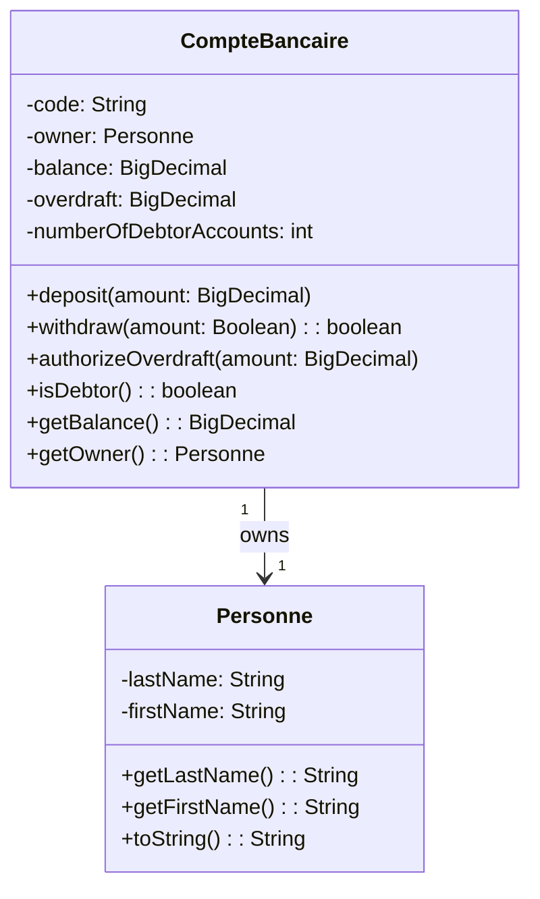
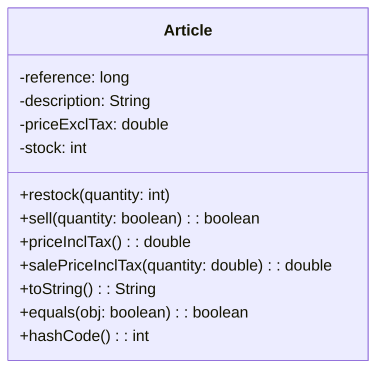
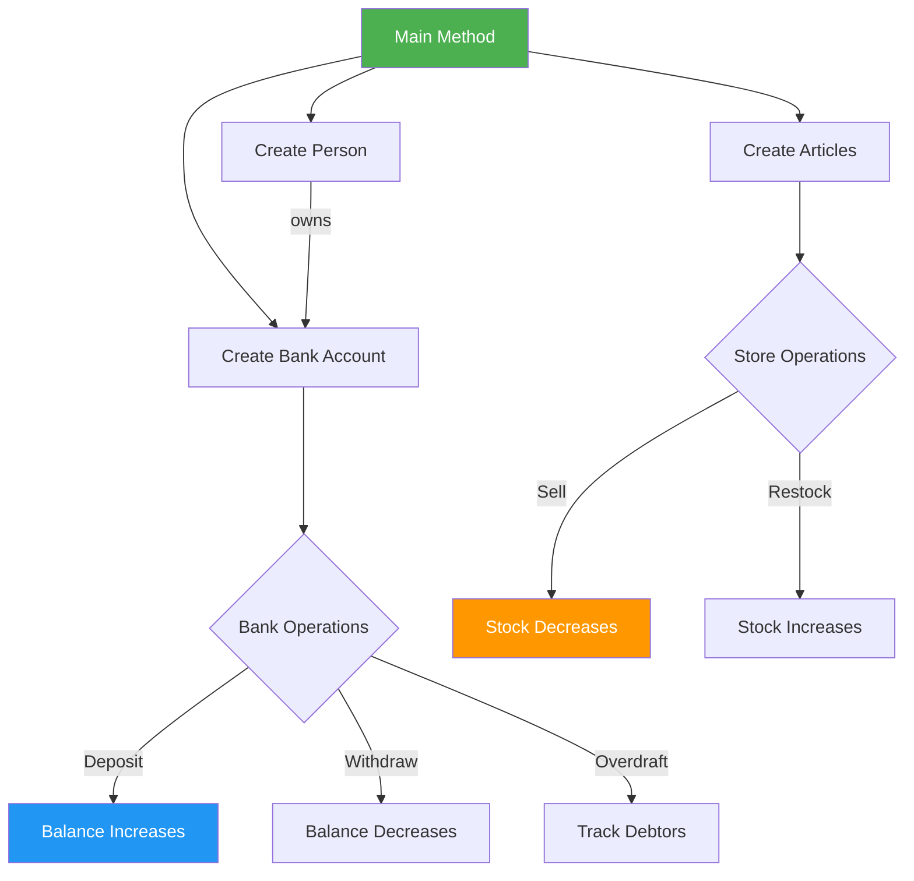

# 🏦 Java OOP Bank & Store Management System

## 🎯 Complete Beginner-Friendly Guide to Object-Oriented Programming

<p align="center">
  
</p>

---

<p align="center">
  <a href="https://www.java.com/">
    
  </a>
  <a href="https://github.com/Lagmouchyoussef/java-oop-bank-store---Simple-and-descriptive/stargazers">
    
  </a>
  <a href="https://github.com/Lagmouchyoussef/java-oop-bank-store---Simple-and-descriptive/forks">
    
  </a>
  <a href="https://github.com/Lagmouchyoussef/java-oop-bank-store---Simple-and-descriptive/issues">
    
  </a>
  <a href="https://github.com/Lagmouchyoussef/java-oop-bank-store---Simple-and-descriptive/blob/master/LICENSE">
    
  </a>
</p>

---

<p align="center">
  
</p>

---

<!-- START TABLE OF CONTENTS -->
<details align="center">
  <summary><h2>📋 Table of Contents</h2></summary>
  
  1. [🤔 What is This Project About?](#1--what-is-this-project-about)
  2. [💻 What is Java? (For Complete Beginners)](#2--what-is-java-for-complete-beginners)
  3. [🎓 What is Object-Oriented Programming?](#3--what-is-object-oriented-programming)
  4. [🛠️ What Can You Do With This Project?](#4--what-can-you-do-with-this-project)
  5. [📦 Prerequisites - What Do You Need?](#5--prerequisites---what-do-you-need)
  6. [💾 Installation Guide - Step by Step](#6--installation-guide---step-by-step)
  7. [🏗️ Project Structure - Understanding the Files](#7--project-structure---understanding-the-files)
  8. [📊 UML Diagrams - Visual Representation](#8--uml-diagrams---visual-representation)
  9. [🚀 How to Run the Project](#9--how-to-run-the-project)
  10. [📖 Step-by-Step Tutorial - Learn by Doing](#10--step-by-step-tutorial---learn-by-doing)
  11. [🔍 Detailed Code Explanation](#11--detailed-code-explanation)
  12. [🧠 OOP Concepts Explained Like You're 5](#12--oop-concepts-explained-like-youre-5)
  13. [❓ Frequently Asked Questions](#13--frequently-asked-questions)
  14. [👨‍💻 About the Author](#14--about-the-author)
  15. [📄 License](#15--license)
</details>
<!-- END TABLE OF CONTENTS -->

---

## 1. 🤔 What is This Project About?

Welcome to this **Java Object-Oriented Programming** project! 🎉

This project is like a **learning playground** where you can understand how programming works in the real world. Think of it as a **digital workshop** where we build two useful applications:

### 🏦 Application 1: Bank Account Management System

Imagine you have a bank app on your phone. What does it do?

| Feature | What It Means | Real-World Example |
|---------|--------------|-------------------|
| 💰 **Create Account** | Making a new bank account | Opening a bank account at the bank |
| 📥 **Deposit** | Putting money IN | You get paid and put money in bank |
| 📤 **Withdraw** | Taking money OUT | You buy something and money comes out |
| ⚠️ **Overdraft** | Borrowing money from bank | Going below $0 in your account |
| 📊 **Track Debtors** | People who owe money | People with negative balance |

### 🛒 Application 2: Store Inventory Management System

Imagine a store owner managing their products:

| Feature | What It Means | Real-World Example |
|---------|--------------|-------------------|
| 📦 **Create Product** | Adding new items | Adding a new phone to sell |
| ➕ **Restock** | Adding more items | Putting more phones in storage |
| ➖ **Sell** | Giving items to customers | Customer buys a phone |
| 💵 **Price with Tax** | Final price you pay | Price + 10% tax |

---

## 2. 💻 What is Java? (For Complete Beginners)

### Imagine This...

Let's say you want to teach a robot how to make a sandwich. You need to give it **step-by-step instructions**:

```
1. Get bread
2. Get peanut butter  
3. Spread peanut butter on bread
4. Get jelly
5. Spread jelly on bread
6. Put another bread on top
7. Give sandwich to person
```

**Java is exactly like this!** It's a language where you give the computer step-by-step instructions to do things.

### But Why is Java Special?

| Why Java is Awesome | Explanation |
|--------------------|-------------|
| 🌍 **Works Everywhere** | Write once, run anywhere! Windows, Mac, Linux, phones, TVs |
| 🏢 **Used by Big Companies** | Google, Amazon, Netflix, Banks all use Java |
| 📚 **Easy to Learn** | English-like syntax, very readable |
| 💼 **High Demand** | Java developers earn good salaries |
| 🔒 **Reliable** | Banks trust Java for money handling |

### Java vs Other Things You Know

```
Java is to Computers what English is to Humans
─────────────────────────────────────────────────
Human: "Hello, how are you?"
Computer: System.out.println("Hello, how are you?");

Human: "If I'm hungry, eat food"
Computer: if (hungry) { eatFood(); }

Human: "Repeat this 5 times"
Computer: for (int i = 0; i < 5; i++) { ... }
```

---

## 3. 🎓 What is Object-Oriented Programming?

### The Simple Explanation

**Object-Oriented Programming (OOP)** is just a way to organize your code that matches how real life works!

### Real-World Example: Dogs 🐕

Think about dogs in real life:

```
DOG (Class/Blueprint)
├── Properties/Attributes:
│   ├── name: "Buddy"
│   ├── color: "Brown"
│   ├── age: 3
│   └── breed: "Golden Retriever"
└── Actions/Methods:
    ├── bark() → "Woof!"
    ├── eat() → Chewing food
    ├── sleep() → ZZZ...
    └── play() → Running around
```

Now, **BUDDY** is a specific dog (an **Object**), and **MAX** is another dog (another **Object**). Both follow the same **DOG** blueprint, but have different values!

### In Our Project:

```
┌─────────────────────────────────────────────────────┐
│  CLASS: Article (The Blueprint)                     │
│  - Every article has:                               │
│    • reference (ID number)                          │
│    • description (what is it?)                     │
│    • priceExclTax (how much?)                      │
│    • stock (how many in store?)                    │
├─────────────────────────────────────────────────────┤
│  OBJECTS (Actual things):                          │
│    📱 Article #1: "iPhone 15", $999, 50 in stock   │
│    📱 Article #2: "Samsung S24", $899, 30 in stock │
│    📱 Article #3: "MacBook", $1499, 10 in stock    │
└─────────────────────────────────────────────────────┘
```

---

## 4. 🛠️ What Can You Do With This Project?

### 🎯 Learning Outcomes

After studying this project, you will understand:

| Concept | You'll Learn |
|---------|-------------|
| ✅ **Classes** | How to create blueprints |
| ✅ **Objects** | How to create actual things from blueprints |
| ✅ **Encapsulation** | How to protect your data |
| ✅ **Constructors** | How to create objects properly |
| ✅ **Methods** | How to define actions |
| ✅ **Variables** | How to store data |
| ✅ **Data Types** | Different kinds of information |

---

## 5. 📦 Prerequisites - What Do You Need?

### Don't Worry! It's Free! 🎁

You only need 2 things:

| Tool | What It Is | Why You Need It | Download |
|------|------------|-----------------|----------|
| **Java JDK 17+** | The Java programming language | To run Java code | [Download Here](https://www.oracle.com/java/technologies/downloads/) |
| **VS Code or IntelliJ** | Where you'll write code | To type and run your programs | [VS Code](https://code.visualstudio.com/) or [IntelliJ](https://www.jetbrains.com/idea/) |

### ⚠️ Important: Verify Java Installation

After you install Java, let's make sure it works:

**For Windows:**
1. Press `Windows + R`
2. Type `cmd` and press Enter
3. Type: `java -version`
4. Press Enter

**For Mac:**
1. Open Terminal (press Cmd + Space, type "terminal")
2. Type: `java -version`
3. Press Enter

**You should see something like:**
```
java version "17.0.x"
Java(TM) SE Runtime Environment (build 17.0.x+...)
```

---

## 6. 💾 Installation Guide - Step by Step

### Step 1: Download the Project �ownload

1. Go to: https://github.com/Lagmouchyoussef/java-oop-bank-store---Simple-and-descriptive
2. Look for the green button that says **"Code"**
3. Click it and select **"Download ZIP"**
4. Save it to your Desktop

### Step 2: Extract the Files 📂

1. Find the ZIP file you just downloaded
2. Right-click on it
3. Select **"Extract All"** or **"Extract Here"**
4. Choose a folder (like "MyJavaProjects")

### Step 3: Open in Your Code Editor 💻

**Option A: Using VS Code (Recommended for Beginners)**

1. Open VS Code
2. Click **File** → **Open Folder**
3. Select the folder you extracted
4. VS Code might ask: "Do you want to install Java extensions?" → Click **"Install"**

**Option B: Using IntelliJ IDEA**

1. Open IntelliJ IDEA
2. Click **File** → **Open**
3. Select the folder
4. Wait for it to load (might take 1-2 minutes)

---

## 7. 🏗️ Project Structure - Understanding the Files

### The File Tree 📁

```
📦 java-oop-bank-store (Our Project)
│
├── 📂 src/ (Source code - where our programs live)
│   │
│   ├── 📂 ma/emsi/projets/ (Package - like a folder)
│   │   │
│   │   ├── 📂 banque/ (Banking module)
│   │   │   ├── 💰 CompteBancaire.java    ← Main bank program
│   │   │   └── 👤 Personne.java           ← Person/Owner class
│   │   │
│   │   └── 📂 magasin/ (Store module)
│   │       └── 📦 Article.java           ← Product class
│   │
│   └── 🚀 Main.java                       ← Starting point
│
├── 📄 README.md (This file!)
├── 📦 TP2.iml (IntelliJ settings)
└── 📜 .gitignore (Git settings)
```

### What Does Each File Do? 🤔

| File | Purpose | In Simple Terms |
|------|---------|----------------|
| `CompteBancaire.java` | Bank account logic | The brain of the bank system |
| `Personne.java` | Person information | Stores name of account owner |
| `Article.java` | Product/store logic | The brain of the store system |
| `Main.java` | Starting point | The door to enter our program |

---

## 8. 📊 UML Diagrams - Visual Representation

### What is UML?

**UML** stands for **Unified Modeling Language**. It's just a way to draw our classes so everyone can understand them easily!

### Bank Account System - Mermaid Diagram



### Store System - Mermaid Diagram



### How Objects Work Together - Mermaid Diagram



---

## 9. 🚀 How to Run the Project

### Method 1: Using Command Line (The Old School Way) ⌨️

**Step 1: Open Terminal/Command Prompt**

**Step 2: Navigate to Your Project**
```bash
cd path/to/your/project/folder
```

**Step 3: Compile the Code** (Translate to machine language)
```bash
# For Bank System
javac -d out src/ma/emsi/projets/banque/*.java

# For Store System
javac -d out src/ma/emsi/projets/magasin/*.java
```

**Step 4: Run the Program**
```bash
# To run Bank System
java -cp out ma.emsi.projets.banque.CompteBancaire

# To run Store System
java -cp out ma.emsi.projets.magasin.Article
```

### Method 2: Using VS Code (Recommended) 🎯

1. Open VS Code
2. Navigate to the file you want to run:
   - `src/ma/emsi/projets/banque/CompteBancaire.java` (for Bank)
   - `src/ma/emsi/projets/magasin/Article.java` (for Store)
3. Right-click anywhere in the file
4. Select **"Run Java"** or press **F5**

### Method 3: Using IntelliJ IDEA ⚡

1. Open IntelliJ IDEA
2. Right-click on the file
3. Click **"Run 'CompteBancaire.main()'"**
4. Or simply press **Shift + F10**

---

## 10. 📖 Step-by-Step Tutorial - Learn by Doing

### Part A: Understanding the Store Module 🛒

#### 🔰 Step 1: What is an Article?

An **Article** is just a product in a store. Think of it like this:

```
📱 Product = Article
   ├── ID number (reference)
   ├── Name (description)  
   ├── Price without tax (priceExclTax)
   └── How many in stock? (stock)
```

#### 🔰 Step 2: Creating Your First Product

Let's create a smartphone to sell:

```java
// This is how we create a new product
Article smartphone = new Article(
    1001,              // 📋 reference (ID number)
    "iPhone 15",       // 📝 description (name)
    799.99,           // 💵 price (without tax)
    50                // 📦 stock (how many we have)
);

// Now we have a smartphone ready to sell!
```

#### 🔰 Step 3: Selling a Product

When someone buys a phone, we need to decrease the stock:

```java
// Customer wants to buy 3 phones
boolean success = smartphone.sell(3);

if (success) {
    // ✅ Sale worked!
    System.out.println("Yay! We sold 3 phones!");
    System.out.println("Phones left: " + smartphone.getStock());
} else {
    // ❌ Not enough stock
    System.out.println("Sorry! We don't have enough phones!");
}
```

#### 🔰 Step 4: Restocking Products

When we get more products from the supplier:

```java
// Add 10 more phones to our inventory
smartphone.restock(10);

System.out.println("We now have: " + smartphone.getStock() + " phones!");
```

#### 🔰 Step 5: Calculating Price with Tax

In Morocco (and many countries), we pay extra tax (TVA):

```java
// The actual price customers pay = price + 10% tax
double actualPrice = smartphone.priceInclTax();

System.out.println("Price without tax: $" + smartphone.getPriceExclTax());
System.out.println("Price WITH tax: $" + actualPrice);

// For multiple items (bulk purchase)
double totalFor5 = smartphone.salePriceInclTax(5);
System.out.println("Price for 5 phones: $" + totalFor5);
```

---

### Part B: Understanding the Bank Module 🏦

#### 🔰 Step 1: What is a Bank Account?

A bank account is like a digital wallet that the bank keeps track of:

```
🏦 Bank Account = CompteBancaire
   ├── Account number (code)
   ├── Who owns it? (owner = Person)
   ├── How much money? (balance - can be NEGATIVE!)
   └── How much can you owe? (overdraft)
```

#### 🔰 Step 2: Creating a Person

Before we can create a bank account, we need someone to own it:

```java
// Create a person (account owner)
Personne owner = new Personne("Smith", "John");

// This creates: John Smith
System.out.println(owner.getFirstName() + " " + owner.getLastName());
// Output: John Smith
```

#### 🔰 Step 3: Creating a Bank Account

Now let's open a bank account:

```java
// Create a new bank account
CompteBancaire myAccount = new CompteBancaire(
    "ACC-001",                          // 📋 Account number
    owner,                              // 👤 Who owns it
    BigDecimal.valueOf(1000)           // 💰 Starting balance: $1000
);

// Let's see account info
System.out.println("Account: " + myAccount.getCode());
System.out.println("Owner: " + myAccount.getOwner());
System.out.println("Balance: $" + myAccount.getBalance());
```

#### 🔰 Step 4: Depositing Money

When you get paid or add money to your account:

```java
// Add $500 to account
myAccount.deposit(BigDecimal.valueOf(500));

System.out.println("New balance: $" + myAccount.getBalance());
// Before: $1000 + $500 = $1500
```

#### 🔰 Step 5: Withdrawing Money

When you spend money:

```java
// Try to take out $200
boolean withdrew = myAccount.withdraw(BigDecimal.valueOf(200));

if (withdrew) {
    System.out.println("Got $200!");
    System.out.println("Remaining: $" + myAccount.getBalance());
} else {
    System.out.println("Not enough money!");
}
```

#### 🔰 Step 6: Setting Overdraft (Borrowing from Bank)

Sometimes you can spend more than you have (up to a limit):

```java
// Allow this account to go up to $500 negative
myAccount.authorizeOverdraft(BigDecimal.valueOf(500));

System.out.println("You can now owe up to: $" + myAccount.getOverdraft());
```

#### 🔰 Step 7: Checking if You're in Debt

Find out if someone owes the bank money:

```java
// Check if account has negative balance
if (myAccount.isDebtor()) {
    System.out.println("⚠️ Warning! This account owes money!");
} else {
    System.out.println("✅ Account is healthy!");
}
```

---

## 11. 🔍 Detailed Code Explanation

### Article.java - The Complete Guide

```java
package ma.emsi.projets.magasin;  // 📁 Which folder this file belongs to
// This is like putting the file in a specific folder

import java.util.Objects;        // 📦 Importing tools we need
import java.util.Scanner;        // 📦 For getting user input

public class Article {          // 🏷️ CLASS DEFINITION
    
    // ═══════════════════════════════════════════════════
    // ATTRIBUTES / FIELDS / PROPERTIES
    // Think of these as adjectives that describe an article
    // ═══════════════════════════════════════════════════
    
    private long reference;              // 📋 Unique ID (like barcode)
    private String description;          // 📝 What is it called?
    private double priceExclTax;         // 💵 Price before tax
    private int stock;                  // 📦 How many we have
    
    // ═══════════════════════════════════════════════════
    // CONSTRUCTOR - How to CREATE a new article
    // ═══════════════════════════════════════════════════
    
    public Article(long reference, String description, 
                   double priceExclTax, int stock) {
        // "this" means "this specific article we're creating"
        this.reference = reference;      // Assign the ID
        this.description = description;  // Assign the name
        this.priceExclTax = priceExclTax; // Assign the price
        this.stock = stock;             // Assign the stock
    }
    
    // ═══════════════════════════════════════════════════
    // METHODS / ACTIONS - What can an article DO?
    // ═══════════════════════════════════════════════════
    
    // Add more items to stock
    public void restock(int numberOfUnits) {
        this.stock = this.stock + numberOfUnits;
        // Same as: this.stock += numberOfUnits;
    }
    
    // Sell items (decrease stock if available)
    public boolean sell(int numberOfUnits) {
        // First, check if we have enough
        if (numberOfUnits <= this.stock) {
            // Yes! Decrease the stock
            this.stock = this.stock - numberOfUnits;
            // Same as: this.stock -= numberOfUnits;
            return true;  // Sale successful!
        }
        // No! Not enough stock
        return false;     // Sale failed!
    }
    
    // Calculate price WITH 10% tax
    public double priceInclTax() {
        return this.priceExclTax * 1.10;
        // Price + 10% = Price * 1.10
    }
    
    // Calculate total for multiple items + tax
    public double salePriceInclTax(int quantity) {
        return (this.priceExclTax * quantity) * 1.10;
    }
}
```

### CompteBancaire.java - The Complete Guide

```java
package ma.emsi.projets.banque;  // 📁 Package folder

import java.math.BigDecimal;    // 📦 For precise money calculations

public class CompteBancaire {   // 🏷️ CLASS
    
    // ═══════════════════════════════════════════════════
    // STATIC VARIABLE - Shared by ALL accounts!
    // ═══════════════════════════════════════════════════
    private static int numberOfDebtorAccounts = 0;
    // ⚠️ This belongs to the CLASS, not to any one account
    // Every account adds to this counter!
    
    // ═══════════════════════════════════════════════════
    // ATTRIBUTES
    // ═══════════════════════════════════════════════════
    
    private String code;                    // 📋 Account number
    private Personne owner;                 // 👤 Who owns this?
    private BigDecimal balance;             // 💰 How much money?
    private BigDecimal overdraft;           // ⚠️ How much can you owe?
    
    // ═══════════════════════════════════════════════════
    // CONSTRUCTORS
    // ═══════════════════════════════════════════════════
    
    // Constructor with all details
    public CompteBancaire(String code, Personne owner, 
                          BigDecimal initialBalance) {
        this.code = code;
        this.owner = owner;
        this.balance = initialBalance;
        this.overdraft = BigDecimal.ZERO;  // Default: no overdraft
        
        // If starting with negative balance, count as debtor
        if (initialBalance.compareTo(BigDecimal.ZERO) < 0) {
            numberOfDebtorAccounts++;
        }
    }
    
    // Constructor with default balance (0)
    public CompteBancaire(String code, Personne owner) {
        this(code, owner, BigDecimal.ZERO);  // Call other constructor
    }
    
    // ═══════════════════════════════════════════════════
    // METHODS
    // ═══════════════════════════════════════════════════
    
    // Add money to account
    public void deposit(BigDecimal amount) {
        if (amount.compareTo(BigDecimal.ZERO) > 0) {
            this.balance = this.balance.add(amount);
        }
    }
    
    // Take money out (returns true if successful)
    public boolean withdraw(BigDecimal amount) {
        // Can we withdraw? Two conditions:
        // 1. Have enough balance
        // 2. Not exceeding overdraft limit
        
        BigDecimal potentialBalance = this.balance.subtract(amount);
        
        if (potentialBalance.compareTo(this.overdraft.negate()) >= 0) {
            // We can withdraw!
            this.balance = potentialBalance;
            
            // Check if now in debt
            if (this.balance.compareTo(BigDecimal.ZERO) < 0) {
                numberOfDebtorAccounts++;
            }
            return true;
        }
        return false; // Cannot withdraw
    }
    
    // Allow overdraft (borrow money from bank)
    public void authorizeOverdraft(BigDecimal amount) {
        if (amount.compareTo(BigDecimal.ZERO) > 0) {
            this.overdraft = amount;
        }
    }
    
    // Check if account is in debt (negative balance)
    public boolean isDebtor() {
        return this.balance.compareTo(BigDecimal.ZERO) < 0;
    }
    
    // Getters - How to READ the private data
    public String getCode() { return this.code; }
    public Personne getOwner() { return this.owner; }
    public BigDecimal getBalance() { return this.balance; }
    public BigDecimal getOverdraft() { return this.overdraft; }
}
```

---

## 12. 🧠 OOP Concepts Explained (Like You're 5!)

### Concept 1: Classes and Objects 🎨

**The Analogy:**

```
CLASS = The RECIPE (instructions for making something)
OBJECT = The actual THING you make from the recipe

Example:
─────────
📋 RECIPE for Cake → CLASS
🎂 Actual Cake → OBJECT

In our project:
──────────────
📋 CLASS "Article" → blueprint for products
📱 OBJECT "iPhone 15" → actual product we created
```

### Concept 2: Encapsulation 🔒

**The Analogy:**

Think of a **bank account** in real life:
- ❌ You CAN'T directly change the balance (imagine if anyone could just add money!)
- ✅ You CAN use methods like deposit() and withdraw()
- The bank controls access to your money!

**In Code:**

```java
// WRONG! ❌ Can't access directly (it's private!)
account.balance = 1000000; 

// RIGHT! ✅ Use proper methods
account.deposit(BigDecimal.valueOf(100)); 
```

### Concept 3: Constructors 🔨

**The Analogy:**

A constructor is like the **factory** that makes objects:

```
🏭 FACTORY → makes → 📦 PRODUCT
CONSTRUCTOR → makes → 📋 OBJECT
```

### Concept 4: Static vs Instance 📊

**The Analogy:**

```
INSTANCE (regular) variable:
- Each OBJECT has its OWN copy
- Like: each person has their own name

Example:
─────────
account1 has balance: $1000
account2 has balance: $500
(They each have their own!)

STATIC variable:
- ALL objects SHARE one copy
- Like: there's only ONE bank for everyone

Example:
─────────
numberOfDebtorAccounts = 5
(All accounts share this counter!)
```

### Concept 5: Getters and Setters 🎁

**The Analogy:**

Think of a **gift box**:
- You can LOOK at what's inside (Getter)
- You can CHANGE what's inside (Setter)
- But you can't just reach in without permission!

```java
// Getter - Look at the value
public BigDecimal getBalance() {
    return this.balance;  // Just looking, not changing
}

// Setter - Change the value (with validation!)
public void setBalance(BigDecimal newBalance) {
    if (newBalance != null) {  // Check it's valid!
        this.balance = newBalance;
    }
}
```

---

## 13. ❓ Frequently Asked Questions

### Q1: I'm completely new to programming. Where do I start?

**A:** Start right here! This project is designed for beginners. Read each section slowly and try to run the code yourself. Don't worry about making mistakes - that's how we learn!

### Q2: What's the difference between Java and JavaScript?

**A:** They're completely different languages! 
- **Java** = Used for apps, games, bank systems, Android apps
- **JavaScript** = Used for websites (making web pages interactive)

### Q3: Why use BigDecimal for money?

**A:** Regular numbers (double) can have tiny errors:
```java
// Regular way - can be wrong!
double result = 0.1 + 0.2;
// Might get: 0.30000000000000004 ❌

// BigDecimal - always correct!
BigDecimal result = new BigDecimal("0.1").add(new BigDecimal("0.2"));
// Gets exactly: 0.3 ✅
```

### Q4: What does @Override mean?

**A:** It means "I'm changing the default behavior":
```java
// Every object has a toString() by default
// But we want OUR own version!

@Override  // We're overriding the default
public String toString() {
    return "Article: " + this.description;
}
```

### Q5: How long does it take to learn Java?

**A:** Everyone learns at different speeds! But with this project:
- **Basic understanding**: 1-2 weeks
- **Comfortable**: 1-3 months
- **Professional**: 1+ year

---

## 14. 👨‍💻 About the Author

<p align="center">
  
</p>

### Youssef Lagmouch

| Platform | Link |
|----------|------|
| 🐙 GitHub | [Lagmouchyoussef](https://github.com/Lagmouchyoussef) |
| 🎓 School | EMSI Casablanca |
| 📚 Year | 3IIR G9 G92 |

---

## 15. 📄 License

This project is open source and available under the [MIT License](LICENSE).

---

<p align="center">
  
</p>

---

<div align="center">

### 🎉 Congratulations! You Made It to the End!

> **Remember:** Every expert was once a beginner. Keep practicing and you'll master Java OOP in no time!

**Don't forget to ⭐ this repository if it helped you!**

</div>
