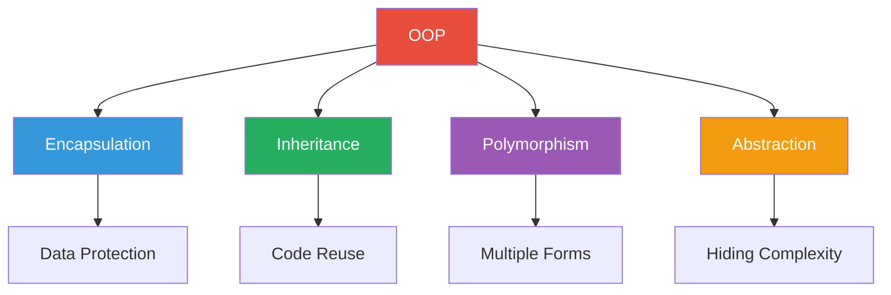
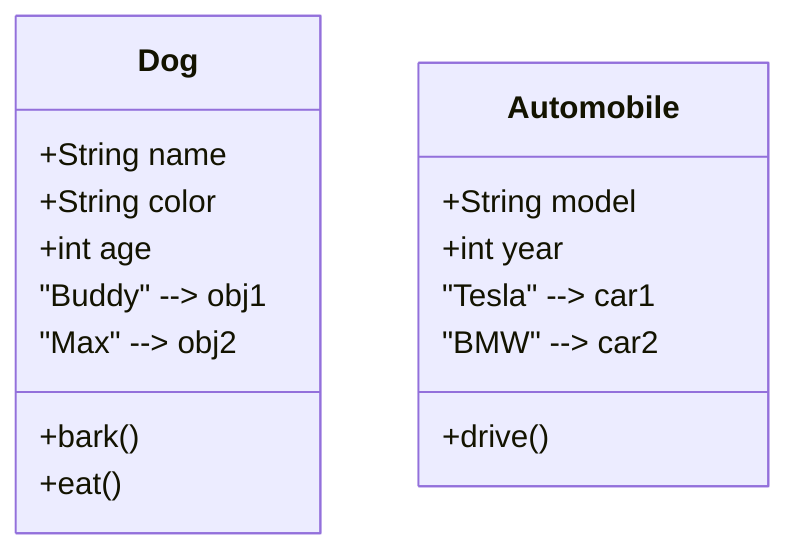
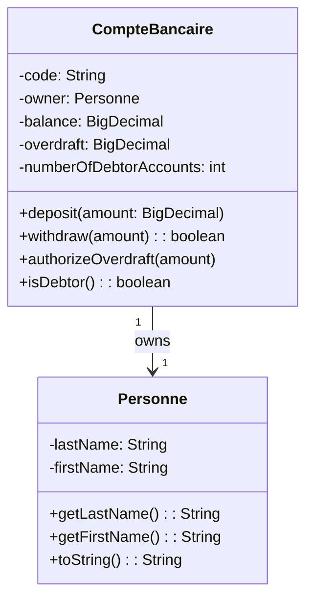
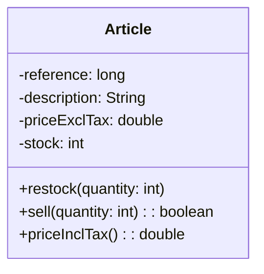
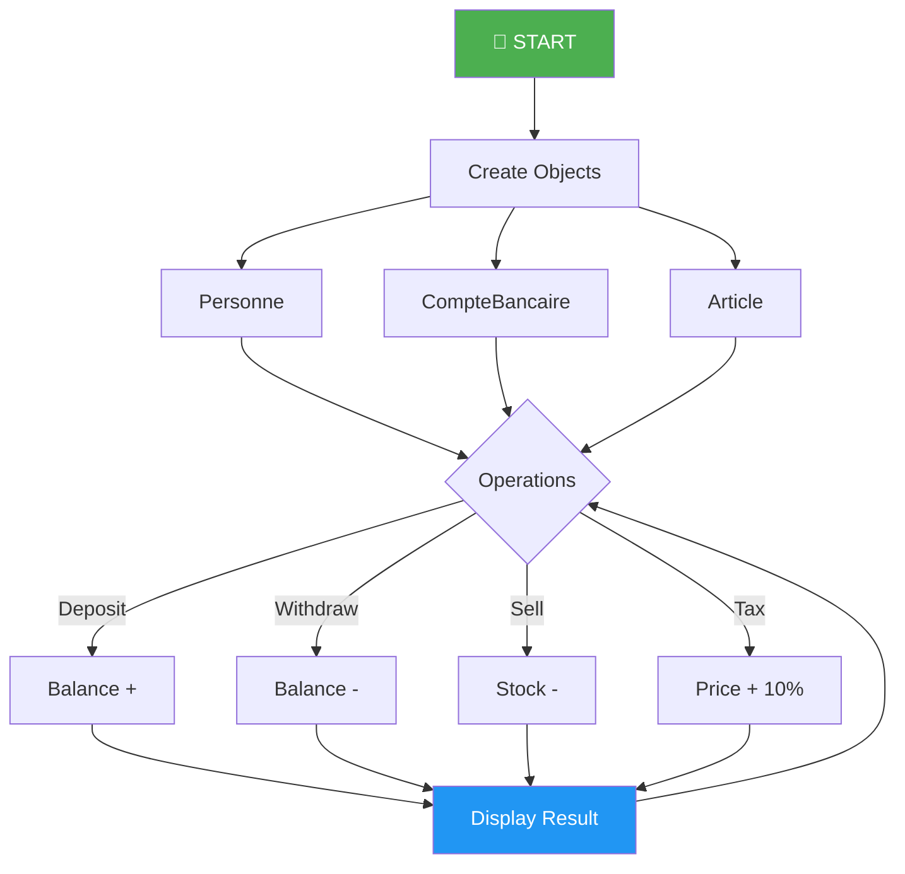

# 🏦💰 Java OOP Bank & Store Management System

<p align="center">
  
</p>

<div align="center">


</div>

---

<p align="center">
  
</p>

---

<p align="center">
  
</p>

---

## 📋 Table of Contents

1. [Project Overview](#1-project-overview)
2. [Introduction to Java](#2-introduction-to-java)
3. [Understanding OOP](#3-understanding-object-oriented-programming)
4. [Project Features](#4-project-features)
5. [System Requirements](#5-system-requirements)
6. [Installation Guide](#6-installation-guide)
7. [Project Architecture](#7-project-architecture)
8. [UML Diagrams](#8-uml-diagrams)
9. [Running the Application](#9-running-the-application)
10. [Comprehensive Tutorial](#10-comprehensive-tutorial)
11. [Detailed Code Analysis](#11-detailed-code-analysis)
12. [OOP Principles Deep Dive](#12-oop-principles-deep-dive)
13. [Best Practices](#13-best-practices)
14. [Troubleshooting](#14-troubleshooting)
15. [Frequently Asked Questions](#15-frequently-asked-questions)

---

## 1. Project Overview

<p align="center">
  
</p>

### Welcome to This Project

Welcome to the **Java OOP Bank & Store Management System** - a comprehensive educational project!

This project demonstrates two complete business applications:

| 🏦 Banking System | 🛒 Store System |
|-------------------|-----------------|
| Create accounts | Create products |
| Deposit/Withdraw | Sell/Restock |
| Overdraft management | Tax calculation |
| Debtor tracking | Inventory management |

### Learning Objectives

| Objective | Description |
|-----------|-------------|
| 🎯 | Master OOP fundamentals |
| 📚 | Understand classes and objects |
| 🔒 | Learn encapsulation |
| 🏗️ | Build real applications |

---

## 2. Introduction to Java

<p align="center">
  
</p>

### What is Java?

Java is a **high-level, object-oriented programming language**!

### Why Java?

| Feature | Icon | Description |
|---------|------|-------------|
| **Platform Independent** | 🖥️📱💻 | Write once, run anywhere |
| **Object-Oriented** | 🧱 | Modular, reusable code |
| **Enterprise Ready** | 🏢 | Used by banks, Google, Amazon |
| **High Demand** | 💰 | Excellent job opportunities |
| **Easy to Learn** | 📖 | English-like syntax |

### Java Comparison

| Language | Java | Python | JavaScript |
|----------|------|---------|------------|
| Typing | Static | Dynamic | Dynamic |
| Platform | All | All | Browser |
| Use Case | Enterprise | AI/Data | Web |

---

## 3. Understanding OOP

<p align="center">
  
</p>

### OOP Core Concepts



### Classes vs Objects



---

## 4. Project Features

### 🏦 Banking System Features

<p align="center">
  
</p>

| Feature | Description | Example |
|---------|-------------|---------|
| ✅ Create Account | Open new account | ACC-001 for John |
| ✅ Deposit | Add money | +$500 |
| ✅ Withdraw | Remove money | -$200 |
| ✅ Overdraft | Set debt limit | $500 max |
| ✅ Track Debtors | Count negatives | 3 accounts |

### 🛒 Store System Features

<p align="center">
  
</p>

| Feature | Description | Example |
|---------|-------------|---------|
| ✅ Create Product | Add item | iPhone 15 |
| ✅ Restock | Add inventory | +50 phones |
| ✅ Sell | Process sale | -5 phones |
| ✅ Tax Calc | Add 10% VAT | $799→$879 |
| ✅ Bulk Price | Multiple items | 10×$879 |

---

## 5. System Requirements

### Software Requirements

| Tool | Version | Purpose | Icon |
|------|---------|---------|------|
| Java JDK | 17+ | Runtime |  |
| VS Code | Latest | Editor |  |
| Git | Latest | Version Control |  |

### Verify Java

```bash
java -version
```

---

## 6. Installation Guide

### Step 1: Download

<p align="center">
  
</p>

1. Go to GitHub repository
2. Click **"Code"** → **"Download ZIP"**

### Step 2: Extract

1. Right-click ZIP file
2. Select **"Extract All"**

### Step 3: Open in IDE

**VS Code:**
```
File → Open Folder → Select Project
```

**IntelliJ IDEA:**
```
File → Open → Select Project
```

---

## 7. Project Architecture

### Directory Structure

```
📦 java-oop-bank-store/
├── 📂 src/
│   ├── 📂 ma/emsi/projets/
│   │   ├── 📂 banque/
│   │   │   ├── CompteBancaire.java
│   │   │   └── Personne.java
│   │   └── 📂 magasin/
│   │       └── Article.java
│   └── Main.java
├── README.md
└── TP2.iml
```

---

## 8. UML Diagrams

### Banking System Class Diagram



### Store System Class Diagram



### System Flow



---

## 9. Running the Application

### Command Line

```bash
# Compile
javac -d out src/ma/emsi/projets/banque/*.java
javac -d out src/ma/emsi/projets/magasin/*.java

# Run Bank
java -cp out ma.emsi.projets.banque.CompteBancaire

# Run Store
java -cp out ma.emsi.projets.magasin.Article
```

### VS Code

| Step | Action |
|------|--------|
| 1 | Open .java file |
| 2 | Right-click |
| 3 | Click "Run Java" |

### IntelliJ IDEA

| Step | Action |
|------|--------|
| 1 | Right-click file |
| 2 | Select "Run" |
| 3 | Or press Shift+F10 |

---

## 10. Comprehensive Tutorial

### Part A: Store Tutorial

#### Create Product

```java
Article phone = new Article(1001, "iPhone 15", 799.99, 50);
System.out.println(phone.getDescription());
// Output: iPhone 15
```

#### Sell Product

```java
phone.sell(3);
// Stock: 50 → 47
```

#### Restock

```java
phone.restock(10);
// Stock: 47 → 57
```

#### Calculate Tax

```java
double price = phone.priceInclTax();
// $799.99 × 1.10 = $879.989
```

---

### Part B: Banking Tutorial

#### Create Person

```java
Personne owner = new Personne("Smith", "John");
```

#### Create Account

```java
CompteBancaire account = new CompteBancaire(
    "ACC-001", 
    owner, 
    BigDecimal.valueOf(1000)
);
```

#### Deposit

```java
account.deposit(BigDecimal.valueOf(500));
// Balance: $1000 → $1500
```

#### Withdraw

```java
account.withdraw(BigDecimal.valueOf(200));
// Balance: $1500 → $1300
```

#### Set Overdraft

```java
account.authorizeOverdraft(BigDecimal.valueOf(500));
```

#### Check Debt

```java
if (account.isDebtor()) {
    System.out.println("In debt!");
}
```

---

## 11. Detailed Code Analysis

### Article.java

```java
package ma.emsi.projets.magasin;

public class Article {
    // ATTRIBUTES
    private long reference;
    private String description;
    private double priceExclTax;
    private int stock;

    // CONSTRUCTOR
    public Article(long reference, String description, 
                   double priceExclTax, int stock) {
        this.reference = reference;
        this.description = description;
        this.priceExclTax = priceExclTax;
        this.stock = stock;
    }

    // METHODS
    public void restock(int numberOfUnits) {
        this.stock += numberOfUnits;
    }

    public boolean sell(int numberOfUnits) {
        if (numberOfUnits <= this.stock) {
            this.stock -= numberOfUnits;
            return true;
        }
        return false;
    }

    public double priceInclTax() {
        return this.priceExclTax * 1.10;
    }

    // GETTERS
    public long getReference() { return this.reference; }
    public String getDescription() { return this.description; }
    public double getPriceExclTax() { return this.priceExclTax; }
    public int getStock() { return this.stock; }
}
```

### CompteBancaire.java

```java
package ma.emsi.projets.banque;
import java.math.BigDecimal;

public class CompteBancaire {
    // STATIC - shared by all accounts
    private static int numberOfDebtorAccounts = 0;
    
    // ATTRIBUTES
    private String code;
    private Personne owner;
    private BigDecimal balance;
    private BigDecimal overdraft;

    // CONSTRUCTOR
    public CompteBancaire(String code, Personne owner, BigDecimal balance) {
        this.code = code;
        this.owner = owner;
        this.balance = balance;
        this.overdraft = BigDecimal.ZERO;
        
        if (balance.compareTo(BigDecimal.ZERO) < 0) {
            numberOfDebtorAccounts++;
        }
    }

    // METHODS
    public void deposit(BigDecimal amount) {
        if (amount.compareTo(BigDecimal.ZERO) > 0) {
            this.balance = this.balance.add(amount);
        }
    }

    public boolean withdraw(BigDecimal amount) {
        BigDecimal potential = this.balance.subtract(amount);
        if (potential.compareTo(this.overdraft.negate()) >= 0) {
            this.balance = potential;
            if (this.balance.compareTo(BigDecimal.ZERO) < 0) {
                numberOfDebtorAccounts++;
            }
            return true;
        }
        return false;
    }

    public void authorizeOverdraft(BigDecimal amount) {
        if (amount.compareTo(BigDecimal.ZERO) > 0) {
            this.overdraft = amount;
        }
    }

    public boolean isDebtor() {
        return this.balance.compareTo(BigDecimal.ZERO) < 0;
    }

    // GETTERS
    public String getCode() { return this.code; }
    public Personne getOwner() { return this.owner; }
    public BigDecimal getBalance() { return this.balance; }
    public BigDecimal getOverdraft() { return this.overdraft; }
}
```

---

## 12. OOP Principles Deep Dive

### Encapsulation

```mermaid
flowchart TB
    subgraph WRONG["❌ WRONG"]
        W1[account.balance = 1000000]
        W2[💥 DANGEROUS!]
    end
    
    subgraph RIGHT["✅ RIGHT"]
        R1[private balance]
        R2[public deposit()]
        R3[public withdraw()]
    end
    
    style WRONG fill:#e74c3c,color:#fff
    style RIGHT fill:#27ae60,color:#fff
```

### Static vs Instance

| Type | Example | Description |
|------|---------|-------------|
| Instance | account.balance | Each account has own |
| Static | numberOfDebtorAccounts | All share one |

---

## 13. Best Practices

| Practice | Icon | Description |
|----------|------|-------------|
| Naming | 📝 | Use meaningful names |
| Comments | 📋 | Document your code |
| Indentation | ↹️ | Keep code clean |
| Testing | 🧪 | Test your code |

---

## 14. Troubleshooting

| Problem | Solution |
|---------|----------|
| Red lines | Check imports |
| Won't run | Check main method |
| Null error | Initialize objects |

---

## 15. FAQ

**Q: Is this for beginners?**
A: Yes! Perfect for learning.

**Q: Why BigDecimal?**
A: Exact money calculations!

**Q: Java vs JavaScript?**
A: Different languages!

---

<p align="center">
  
</p>

---

<p align="center">
  ⭐ Star this repo if it helped!
</p>

<p align="center">
  Made with ❤️
</p>
