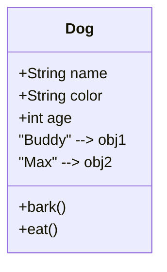
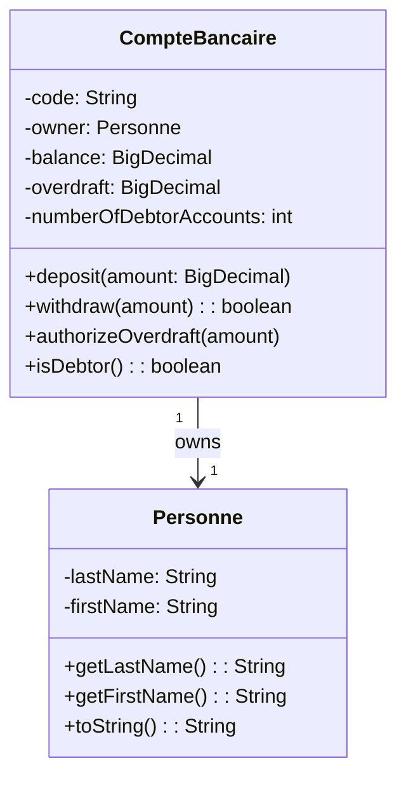
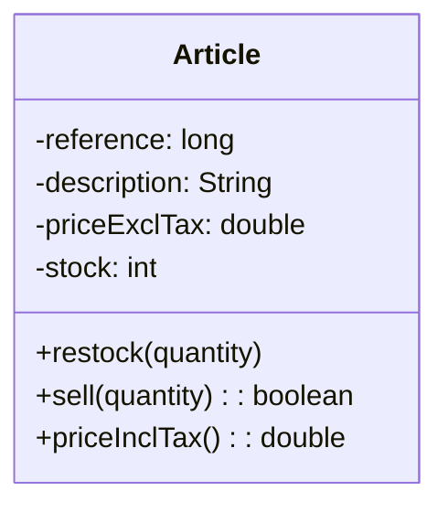
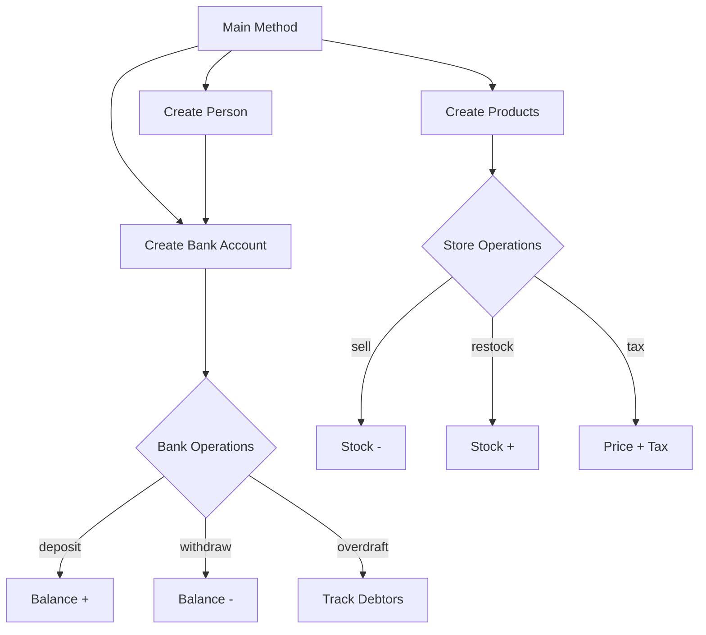

# 🏦💰 Java OOP Bank & Store Management System

## Complete Guide for Beginners

<p align="center">
  
</p>

<div align="center">


</div>

---

<p align="center">
  
</p>

---

## 📋 Table of Contents

1. [What is This Project?](#1-what-is-this-project)
2. [What is Java?](#2-what-is-java)
3. [What is OOP?](#3-what-is-object-oriented-programming)
4. [Project Features](#4-project-features)
5. [Prerequisites](#5-prerequisites)
6. [Installation](#6-installation)
7. [Project Structure](#7-project-structure)
8. [UML Diagrams](#8-uml-diagrams)
9. [How to Run](#9-how-to-run)
10. [Step-by-Step Tutorial](#10-step-by-step-tutorial)
11. [Code Explanation](#11-code-explanation)
12. [OOP Concepts](#12-oop-concepts)
13. [FAQ](#13-faq)
14. [Author](#14-author)

---

## 1. What is This Project?

<p align="center">
  
</p>

This is a comprehensive Java OOP project for learning purposes. It includes two complete applications:

### 🏦 Banking System

| Feature | Description |
|---------|-------------|
| Create Account | Open new bank accounts |
| Deposit | Add money to account |
| Withdraw | Take money out |
| Overdraft | Set borrowing limit |
| Track Debtors | Monitor negative balance accounts |

### 🛒 Store System

| Feature | Description |
|---------|-------------|
| Create Product | Add new items to inventory |
| Restock | Add more stock |
| Sell | Process sales |
| Calculate Tax | Price with 10% tax |
| Bulk Pricing | Multiple items pricing |

---

## 2. What is Java?

<p align="center">
  
</p>

Java is a programming language where you give the computer step-by-step instructions to perform tasks.

### Why Learn Java?

| Reason | Explanation |
|--------|-------------|
| **Write Once, Run Anywhere** | Works on Windows, Mac, Linux, Android |
| **Industry Standard** | Used by Google, Amazon, Netflix, Banks |
| **Easy to Learn** | English-like syntax |
| **High Demand** | Excellent job opportunities |
| **Reliable** | Banks trust Java for financial systems |

### Java vs Human Language

| Human Says | Java Code |
|------------|-----------|
| "Hello, how are you?" | `System.out.println("Hello");` |
| "If hungry, eat food" | `if (hungry) { eatFood(); }` |
| "Repeat 5 times" | `for (int i=0; i<5; i++) { }` |

---

## 3. What is Object-Oriented Programming?

<p align="center">
  
</p>

OOP is a way to organize code that matches real-world concepts!

### Classes and Objects



**Class** = Blueprint (Recipe)
**Object** = Actual thing created (Cake)

---

## 4. Project Features

### 🏦 Banking Features

<p align="center">
  
</p>

- Create bank accounts with unique codes
- Deposit and withdraw money
- Set overdraft limits
- Track number of debtor accounts
- View account balance and owner

### 🛒 Store Features

<p align="center">
  
</p>

- Create products with reference numbers
- Manage inventory (restock)
- Process sales
- Calculate prices with 10% tax
- Bulk pricing calculations

---

## 5. Prerequisites

| Tool | Version | Purpose | Download |
|------|---------|---------|----------|
| Java JDK | 17+ | Programming language | [Download](https://www.oracle.com/java/technologies/downloads/) |
| VS Code | Latest | Code editor | [Download](https://code.visualstudio.com/) |
| Git | Latest | Version control | [Download](https://git-scm.com/) |

**Verify Java Installation:**
```bash
java -version
```

---

## 6. Installation

### Step 1: Download
1. Go to GitHub repository
2. Click green "Code" button
3. Click "Download ZIP"

### Step 2: Extract
1. Right-click ZIP file
2. Select "Extract All"
3. Choose folder location

### Step 3: Open in IDE

**VS Code:**
1. Open VS Code
2. File → Open Folder
3. Select project folder

**IntelliJ IDEA:**
1. Open IntelliJ
2. File → Open
3. Select project folder

---

## 7. Project Structure

```
📦 java-oop-bank-store
├── 📂 src/
│   ├── 📂 ma/emsi/projets/
│   │   ├── 📂 banque/
│   │   │   ├── CompteBancaire.java
│   │   │   └── Personne.java
│   │   └── 📂 magasin/
│   │       └── Article.java
│   └── Main.java
├── README.md
└── TP2.iml
```

---

## 8. UML Diagrams

### Bank Account System



### Store System



### How It Works



---

## 9. How to Run

### Command Line
```bash
# Compile
javac -d out src/ma/emsi/projets/banque/*.java
javac -d out src/ma/emsi/projets/magasin/*.java

# Run Bank
java -cp out ma.emsi.projets.banque.CompteBancaire

# Run Store
java -cp out ma.emsi.projets.magasin.Article
```

### VS Code
1. Open .java file
2. Right-click → Run Java
3. Or press F5

### IntelliJ IDEA
1. Right-click on file
2. Select Run
3. Or press Shift + F10

---

## 10. Step-by-Step Tutorial

### Part A: Store Module

#### Step 1: Create a Product
```java
Article smartphone = new Article(
    1001,              // reference
    "iPhone 15",       // description  
    799.99,           // price without tax
    50                // stock quantity
);
```

#### Step 2: Sell Products
```java
boolean success = smartphone.sell(3);

if (success) {
    System.out.println("Sold 3 phones!");
    System.out.println("Remaining: " + smartphone.getStock());
} else {
    System.out.println("Not enough stock!");
}
```

#### Step 3: Restock
```java
smartphone.restock(10);
System.out.println("New stock: " + smartphone.getStock());
```

#### Step 4: Calculate Price with Tax
```java
double price = smartphone.priceInclTax();
System.out.println("Price with tax: $" + price);

double total = smartphone.salePriceInclTax(5);
System.out.println("Total for 5: $" + total);
```

---

### Part B: Bank Module

#### Step 1: Create a Person
```java
Personne owner = new Personne("Smith", "John");
System.out.println(owner.getFirstName() + " " + owner.getLastName());
// Output: John Smith
```

#### Step 2: Create Bank Account
```java
CompteBancaire account = new CompteBancaire(
    "ACC-001",                    // account code
    owner,                        // owner
    BigDecimal.valueOf(1000)      // initial balance
);
```

#### Step 3: Deposit Money
```java
account.deposit(BigDecimal.valueOf(500));
System.out.println("Balance: $" + account.getBalance());
// Result: 1500
```

#### Step 4: Withdraw Money
```java
boolean success = account.withdraw(BigDecimal.valueOf(200));

if (success) {
    System.out.println("Withdrawn $200!");
    System.out.println("Balance: $" + account.getBalance());
}
```

#### Step 5: Set Overdraft
```java
account.authorizeOverdraft(BigDecimal.valueOf(500));
System.out.println("Overdraft limit: $" + account.getOverdraft());
```

#### Step 6: Check for Debt
```java
if (account.isDebtor()) {
    System.out.println("Account owes money!");
} else {
    System.out.println("Account is healthy!");
}
```

---

## 11. Code Explanation

### Article.java - Complete

```java
package ma.emsi.projets.magasin;

// ATTRIBUTES - What each article HAS
private long reference;              // Unique ID (like barcode)
private String description;          // What is it called?
private double priceExclTax;        // Price before tax
private int stock;                  // How many in store?

// CONSTRUCTOR - How to CREATE a new article
public Article(long reference, String description, 
               double priceExclTax, int stock) {
    this.reference = reference;
    this.description = description;
    this.priceExclTax = priceExclTax;
    this.stock = stock;
}

// Add more items to inventory
public void restock(int numberOfUnits) {
    this.stock += numberOfUnits;
}

// Sell items (decrease stock if available)
public boolean sell(int numberOfUnits) {
    if (numberOfUnits <= this.stock) {
        this.stock -= numberOfUnits;
        return true;
    }
    return false;
}

// Calculate price with 10% tax
public double priceInclTax() {
    return this.priceExclTax * 1.10;
}
```

### CompteBancaire.java - Complete

```java
package ma.emsi.projets.banque;
import java.math.BigDecimal;

// STATIC - Shared by ALL accounts!
private static int numberOfDebtorAccounts = 0;

// ATTRIBUTES
private String code;
private Personne owner;
private BigDecimal balance;
private BigDecimal overdraft;

// CONSTRUCTOR
public CompteBancaire(String code, Personne owner, BigDecimal balance) {
    this.code = code;
    this.owner = owner;
    this.balance = balance;
    this.overdraft = BigDecimal.ZERO;
    
    if (balance.compareTo(BigDecimal.ZERO) < 0) {
        numberOfDebtorAccounts++;
    }
}

// Deposit money
public void deposit(BigDecimal amount) {
    if (amount.compareTo(BigDecimal.ZERO) > 0) {
        this.balance = this.balance.add(amount);
    }
}

// Withdraw money
public boolean withdraw(BigDecimal amount) {
    BigDecimal potential = this.balance.subtract(amount);
    if (potential.compareTo(this.overdraft.negate()) >= 0) {
        this.balance = potential;
        if (this.balance.compareTo(BigDecimal.ZERO) < 0) {
            numberOfDebtorAccounts++;
        }
        return true;
    }
    return false;
}

// Set overdraft
public void authorizeOverdraft(BigDecimal amount) {
    if (amount.compareTo(BigDecimal.ZERO) > 0) {
        this.overdraft = amount;
    }
}

// Check if in debt
public boolean isDebtor() {
    return this.balance.compareTo(BigDecimal.ZERO) < 0;
}
```

---

## 12. OOP Concepts

### Classes & Objects

**Class** = Blueprint (Recipe for cake)
**Object** = Actual thing (The cake itself)

### Encapsulation

- **Private** = Can't access directly (protected)
- **Public** = Can access through methods

### Constructors

Special method that creates new objects

### Static vs Instance

- **Instance** = Each object has its own
- **Static** = All objects share one copy

### Getters & Setters

- **Getter** = Read value
- **Setter** = Change value (with validation)

---

## 13. FAQ

### Q: I'm completely new. Where do I start?
A: Start here! This guide is for total beginners.

### Q: What's the difference between Java and JavaScript?
A: Java = apps, games, Android. JavaScript = websites.

### Q: Why use BigDecimal for money?
A: Regular numbers have tiny errors. BigDecimal is exact!

### Q: What does @Override mean?
A: "I'm changing the default behavior"

### Q: How long to learn Java?
A: Basic understanding: 1-2 weeks. Comfortable: 1-3 months.

---

## 14. Author

| Platform | Link |
|----------|------|
| GitHub | [Lagmouchyoussef](https://github.com/Lagmouchyoussef) |

---

<p align="center">
  
</p>

---

<p align="center">
  ⭐ Star this repository if it helped you!
</p>

<p align="center">
  Made with ❤️
</p>
