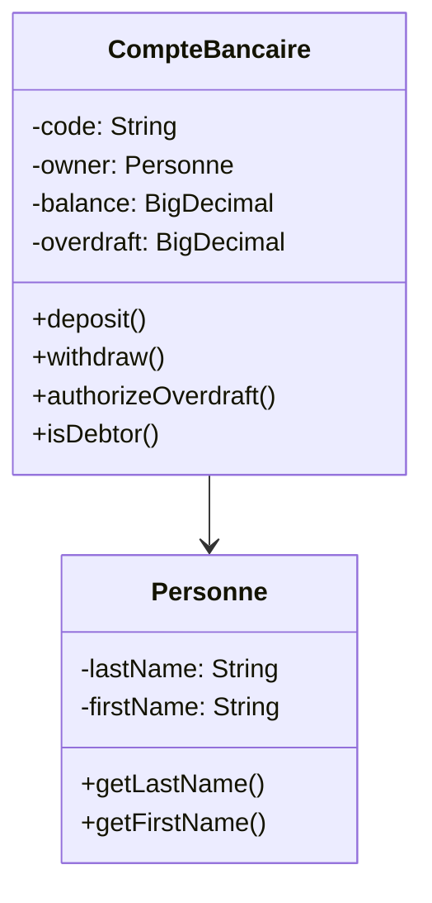
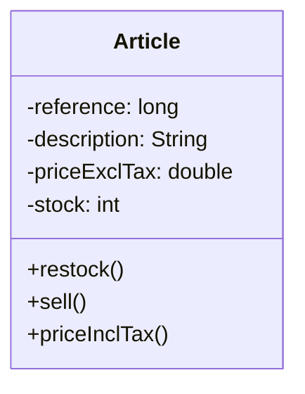

# Java OOP Bank & Store Management

<p align="center">
  
</p>

<div align="center">


</div>

---

## Table of Contents

1. [About This Project](#1-about-this-project)
2. [What is Java?](#2-what-is-java)
3. [What is OOP?](#3-what-is-oop)
4. [Features](#4-features)
5. [Prerequisites](#5-prerequisites)
6. [Installation](#6-installation)
7. [Project Structure](#7-project-structure)
8. [UML Diagrams](#8-uml-diagrams)
9. [How to Run](#9-how-to-run)
10. [Tutorial](#10-tutorial)
11. [Code Explanation](#11-code-explanation)
12. [OOP Concepts](#12-oop-concepts)
13. [FAQ](#13-faq)
14. [Author](#14-author)

---

## 1. About This Project

This is a Java OOP learning project with two complete applications:

| Banking System | Store System |
|----------------|--------------|
| Create accounts | Create products |
| Deposit/Withdraw | Sell/Restock |
| Track debtors | Calculate prices |

---

## 2. What is Java?

Java is a programming language where you give the computer step-by-step instructions.

**Why Java?**
- Works on Windows, Mac, Linux, phones
- Used by Google, Amazon, Banks
- Easy to learn
- High demand jobs

---

## 3. What is OOP?

OOP organizes code to match real life. You create **classes** (blueprints) and **objects** (actual things).

**Example:**
- Class "Dog" → Object "Buddy", "Max"
- Class "Article" → Object "iPhone", "MacBook"
- Class "CompteBancaire" → Object John's Account

---

## 4. Features

### Banking System
- Create bank accounts
- Deposit money
- Withdraw money  
- Set overdraft limits
- Track debtor accounts

### Store System
- Create products
- Restock inventory
- Sell products
- Calculate prices with tax

---

## 5. Prerequisites

| Tool | Version | Download |
|------|---------|----------|
| Java JDK | 17+ | [Download](https://www.oracle.com/java/technologies/downloads/) |
| VS Code | Latest | [Download](https://code.visualstudio.com/) |
| Git | Latest | [Download](https://git-scm.com/) |

**Verify Java:**
```bash
java -version
```

---

## 6. Installation

**Step 1:** Download ZIP from GitHub

**Step 2:** Extract the folder

**Step 3:** Open in your IDE (VS Code or IntelliJ)

---

## 7. Project Structure

```
java-oop-bank-store/
├── src/
│   ├── ma/emsi/projets/
│   │   ├── banque/
│   │   │   ├── CompteBancaire.java
│   │   │   └── Personne.java
│   │   └── magasin/
│   │       └── Article.java
│   └── Main.java
├── README.md
└── TP2.iml
```

---

## 8. UML Diagrams

### Bank System



### Store System



---

## 9. How to Run

### Command Line

```bash
# Compile
javac -d out src/ma/emsi/projets/banque/*.java
javac -d out src/ma/emsi/projets/magasin/*.java

# Run Bank
java -cp out ma.emsi.projets.banque.CompteBancaire

# Run Store
java -cp out ma.emsi.projets.magasin.Article
```

### VS Code

1. Open file
2. Right-click → Run Java

### IntelliJ IDEA

1. Open Project
2. Find file in left panel
3. Click green play button next to main()

---

## 10. Tutorial

### Store: Create Product

```java
Article phone = new Article(1001, "iPhone 15", 799.99, 50);
```

### Store: Sell

```java
phone.sell(3);  // Sell 3 phones
```

### Store: Restock

```java
phone.restock(10);  // Add 10 more
```

### Store: Price with Tax

```java
double price = phone.priceInclTax();  // +10% tax
```

### Bank: Create Account

```java
Personne owner = new Personne("Smith", "John");
CompteBancaire account = new CompteBancaire("ACC-001", owner, BigDecimal.valueOf(1000));
```

### Bank: Deposit

```java
account.deposit(BigDecimal.valueOf(500));
```

### Bank: Withdraw

```java
account.withdraw(BigDecimal.valueOf(200));
```

### Bank: Overdraft

```java
account.authorizeOverdraft(BigDecimal.valueOf(500));
```

---

## 11. Code Explanation

### Article.java

```java
package ma.emsi.projets.magasin;

public class Article {
    // Attributes
    private long reference;
    private String description;
    private double priceExclTax;
    private int stock;

    // Constructor
    public Article(long reference, String description, 
                   double priceExclTax, int stock) {
        this.reference = reference;
        this.description = description;
        this.priceExclTax = priceExclTax;
        this.stock = stock;
    }

    // Add stock
    public void restock(int numberOfUnits) {
        this.stock += numberOfUnits;
    }

    // Sell (decrease stock)
    public boolean sell(int numberOfUnits) {
        if (numberOfUnits <= this.stock) {
            this.stock -= numberOfUnits;
            return true;
        }
        return false;
    }

    // Price with tax
    public double priceInclTax() {
        return this.priceExclTax * 1.10;
    }
}
```

### CompteBancaire.java

```java
package ma.emsi.projets.banque;
import java.math.BigDecimal;

public class CompteBancaire {
    private static int numberOfDebtorAccounts = 0;
    
    private String code;
    private Personne owner;
    private BigDecimal balance;
    private BigDecimal overdraft;

    public CompteBancaire(String code, Personne owner, BigDecimal balance) {
        this.code = code;
        this.owner = owner;
        this.balance = balance;
        this.overdraft = BigDecimal.ZERO;
        
        if (balance.compareTo(BigDecimal.ZERO) < 0) {
            numberOfDebtorAccounts++;
        }
    }

    public void deposit(BigDecimal amount) {
        if (amount.compareTo(BigDecimal.ZERO) > 0) {
            this.balance = this.balance.add(amount);
        }
    }

    public boolean withdraw(BigDecimal amount) {
        BigDecimal potential = this.balance.subtract(amount);
        if (potential.compareTo(this.overdraft.negate()) >= 0) {
            this.balance = potential;
            if (this.balance.compareTo(BigDecimal.ZERO) < 0) {
                numberOfDebtorAccounts++;
            }
            return true;
        }
        return false;
    }

    public void authorizeOverdraft(BigDecimal amount) {
        if (amount.compareTo(BigDecimal.ZERO) > 0) {
            this.overdraft = amount;
        }
    }

    public boolean isDebtor() {
        return this.balance.compareTo(BigDecimal.ZERO) < 0;
    }
}
```

---

## 12. OOP Concepts

### Classes & Objects

- **Class** = Blueprint (Recipe)
- **Object** = Actual thing (Cake)

### Encapsulation

- **Private** = Can't access directly
- **Public** = Can access through methods

### Constructors

- Special method to create objects

### Static vs Instance

- **Instance** = Each object has own
- **Static** = All objects share one

### Getters/Setters

- **Getter** = Read data
- **Setter** = Change data (with validation)

---

## 13. FAQ

**Q: I'm new to programming. Where do I start?**
A: Start here! This guide is for beginners.

**Q: Java vs JavaScript?**
A: Different languages! Java = apps/games, JavaScript = websites.

**Q: Why BigDecimal for money?**
A: Regular numbers have tiny errors. BigDecimal is exact.

**Q: What does @Override mean?**
A: "I'm changing the default behavior"

---

## 14. Author

| Platform | Link |
|----------|------|
| GitHub | [Lagmouchyoussef](https://github.com/Lagmouchyoussef) |

---

<p align="center">
  ⭐ Star this repo if it helped!
</p>

<p align="center">
  Made with ❤️
</p>
